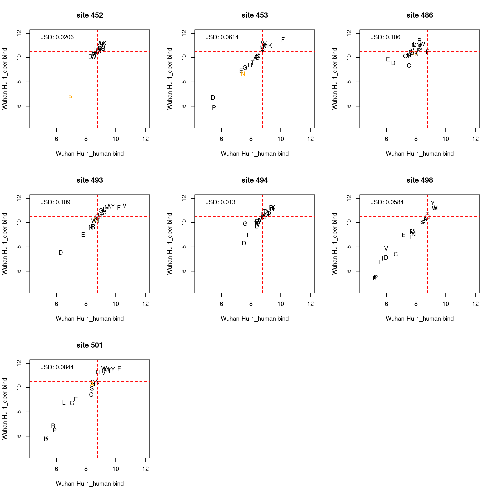
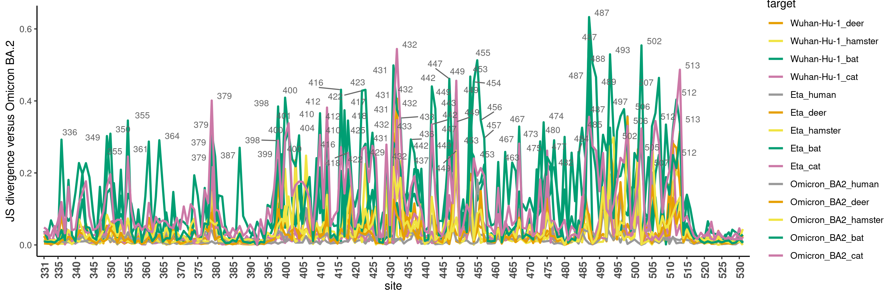
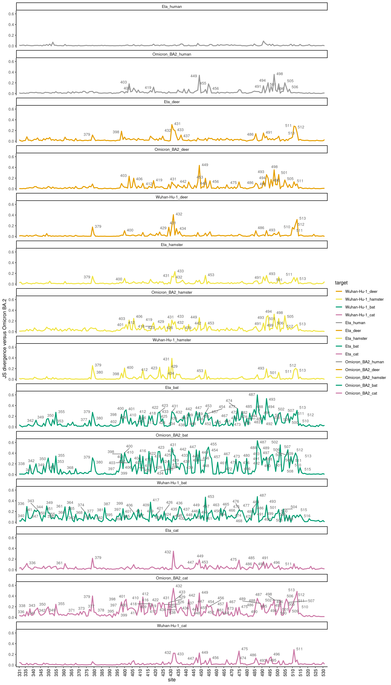

Shifts in mutation effects for binding to different ACE2s
================
Tyler Starr
6/16/2023

- <a href="#setup" id="toc-setup">Setup</a>
- <a
  href="#calculate-site-wise-jensen-shannon-divergence-a-metric-of-divergence-in-site-specific-mutational-profiles"
  id="toc-calculate-site-wise-jensen-shannon-divergence-a-metric-of-divergence-in-site-specific-mutational-profiles">Calculate
  site-wise Jensen-Shannon divergence, a metric of divergence in
  site-specific mutational profiles</a>
- <a
  href="#line-plots-of-js-divergence-from-wh1-binding-to-huace2-across-rbd-sites"
  id="toc-line-plots-of-js-divergence-from-wh1-binding-to-huace2-across-rbd-sites">Line
  plots of JS divergence from WH1 binding to huACE2 across RBD sites</a>
- <a href="#map-divergence-to-pdb-structure"
  id="toc-map-divergence-to-pdb-structure">Map divergence to pdb
  structure</a>

This notebook analyzes sites whose mutation effects deviate most
strongly among the variant RBD backgrounds.

``` r
#list of packages to install/load
packages = c("yaml","data.table","tidyverse","gridExtra","bio3d","ggridges","ggrepel","GGally")
#install any packages not already installed
installed_packages <- packages %in% rownames(installed.packages())
if(any(installed_packages == F)){
  install.packages(packages[!installed_packages],
                   lib=c(paste("/uufs/chpc.utah.edu/common/home/",Sys.getenv("USER"),"/RLibs/",Sys.getenv("R_VERSION"),sep="")),
                   repos=c("http://cran.us.r-project.org"))
}
#load packages
invisible(lapply(packages, library, character.only=T))

knitr::opts_chunk$set(echo = T)
knitr::opts_chunk$set(dev.args = list(png = list(type = "cairo")))

#read in config file
config <- read_yaml("config.yaml")

#make output directory
if(!file.exists(config$epistatic_shifts_dir)){
  dir.create(file.path(config$epistatic_shifts_dir))
}

#make pdb output directory
if(!file.exists(paste(config$epistatic_shifts_dir,"/pdbs/",sep=""))){
  dir.create(file.path(paste(config$epistatic_shifts_dir,"/pdbs/",sep="")))
}
```

Session info for reproducing environment:

``` r
sessionInfo()
```

    ## R version 4.1.3 (2022-03-10)
    ## Platform: x86_64-pc-linux-gnu (64-bit)
    ## Running under: Rocky Linux 8.5 (Green Obsidian)
    ## 
    ## Matrix products: default
    ## BLAS/LAPACK: /uufs/chpc.utah.edu/sys/spack/linux-rocky8-nehalem/gcc-8.5.0/intel-oneapi-mkl-2021.4.0-h43nkmwzvaltaa6ii5l7n6e7ruvjbmnv/mkl/2021.4.0/lib/intel64/libmkl_rt.so.1
    ## 
    ## locale:
    ##  [1] LC_CTYPE=en_US.UTF-8       LC_NUMERIC=C              
    ##  [3] LC_TIME=en_US.UTF-8        LC_COLLATE=en_US.UTF-8    
    ##  [5] LC_MONETARY=en_US.UTF-8    LC_MESSAGES=en_US.UTF-8   
    ##  [7] LC_PAPER=en_US.UTF-8       LC_NAME=C                 
    ##  [9] LC_ADDRESS=C               LC_TELEPHONE=C            
    ## [11] LC_MEASUREMENT=en_US.UTF-8 LC_IDENTIFICATION=C       
    ## 
    ## attached base packages:
    ## [1] stats     graphics  grDevices utils     datasets  methods   base     
    ## 
    ## other attached packages:
    ##  [1] GGally_2.1.2      ggrepel_0.9.1     ggridges_0.5.4    bio3d_2.4-4      
    ##  [5] gridExtra_2.3     forcats_0.5.1     stringr_1.4.0     dplyr_1.0.8      
    ##  [9] purrr_0.3.4       readr_2.1.2       tidyr_1.2.0       tibble_3.1.6     
    ## [13] ggplot2_3.4.1     tidyverse_1.3.1   data.table_1.14.2 yaml_2.3.5       
    ## 
    ## loaded via a namespace (and not attached):
    ##  [1] Rcpp_1.0.8         lubridate_1.8.0    assertthat_0.2.1   digest_0.6.29     
    ##  [5] utf8_1.2.2         R6_2.5.1           cellranger_1.1.0   plyr_1.8.6        
    ##  [9] backports_1.4.1    reprex_2.0.1       evaluate_0.15      httr_1.4.6        
    ## [13] pillar_1.7.0       rlang_1.0.6        readxl_1.3.1       rstudioapi_0.13   
    ## [17] rmarkdown_2.13     munsell_0.5.0      broom_0.7.12       compiler_4.1.3    
    ## [21] modelr_0.1.8       xfun_0.30          pkgconfig_2.0.3    htmltools_0.5.2   
    ## [25] tidyselect_1.1.2   reshape_0.8.8      fansi_1.0.2        crayon_1.5.0      
    ## [29] tzdb_0.2.0         dbplyr_2.1.1       withr_2.5.0        grid_4.1.3        
    ## [33] jsonlite_1.8.4     gtable_0.3.0       lifecycle_1.0.3    DBI_1.1.2         
    ## [37] magrittr_2.0.2     scales_1.2.1       cli_3.6.0          stringi_1.7.6     
    ## [41] fs_1.5.2           xml2_1.3.3         ellipsis_0.3.2     generics_0.1.2    
    ## [45] vctrs_0.5.2        RColorBrewer_1.1-2 tools_4.1.3        glue_1.6.2        
    ## [49] hms_1.1.1          parallel_4.1.3     fastmap_1.1.0      colorspace_2.0-3  
    ## [53] rvest_1.0.2        knitr_1.37         haven_2.4.3

Define colorblind-friendly palette

``` r
# The palette with grey:
cbPalette <- c("#999999", "#E69F00", "#56B4E9", "#009E73", "#F0E442", 
               "#0072B2", "#D55E00", "#CC79A7")
# The palette with black
cbbPalette <- c("#000000", "#E69F00", "#56B4E9", "#009E73", "#F0E442", 
                "#0072B2", "#D55E00", "#CC79A7")
```

## Setup

Read in tables of mutant measurements from current study and prior VOCs
DMS datasets.

``` r
dt <- data.table(read.csv(file=config$final_variant_scores_mut_file,stringsAsFactors=F))[,.(target,wildtype,position,mutant,mutation,
                                                                                            bind_deer,delta_bind_deer,n_bc_deer,
                                                                                            bind_hamster,delta_bind_hamster,n_bc_hamster,
                                                                                            bind_bat,delta_bind_bat,n_bc_bat,
                                                                                            bind_cat,delta_bind_cat,n_bc_cat,
                                                                                            bind_human_monomer,delta_bind_human_monomer,n_bc_human_monomer,
                                                                                            bind_human_dimer,delta_bind_human_dimer)]

setkey(dt,target,position,mutant)

#manually "melt" table so that "target" is a combination of background+ACE2?
dt_deer <- dt[,.(target,wildtype,position,mutant,mutation, bind_deer,delta_bind_deer,n_bc_deer)]
dt_hamster <- dt[,.(target,wildtype,position,mutant,mutation, bind_hamster,delta_bind_hamster,n_bc_hamster)]
dt_bat <- dt[,.(target,wildtype,position,mutant,mutation, bind_bat,delta_bind_bat,n_bc_bat)]
dt_cat <- dt[,.(target,wildtype,position,mutant,mutation, bind_cat,delta_bind_cat,n_bc_cat)]
dt_human <- dt[,.(target,wildtype,position,mutant,mutation, bind_human_monomer,delta_bind_human_monomer,n_bc_human_monomer)]

dt_deer$target <- paste(dt_deer$target,"deer",sep="_")
dt_hamster$target <- paste(dt_hamster$target,"hamster",sep="_")
dt_bat$target <- paste(dt_bat$target,"bat",sep="_")
dt_cat$target <- paste(dt_cat$target,"cat",sep="_")
dt_human$target <- paste(dt_human$target,"human",sep="_")

setnames(dt_deer, c("bind_deer", "delta_bind_deer", "n_bc_deer"), c("bind", "delta_bind", "n_bc"))
setnames(dt_hamster, c("bind_hamster", "delta_bind_hamster", "n_bc_hamster"), c("bind", "delta_bind", "n_bc"))
setnames(dt_bat, c("bind_bat", "delta_bind_bat", "n_bc_bat"), c("bind", "delta_bind", "n_bc"))
setnames(dt_cat, c("bind_cat", "delta_bind_cat", "n_bc_cat"), c("bind", "delta_bind", "n_bc"))
setnames(dt_human, c("bind_human_monomer", "delta_bind_human_monomer", "n_bc_human_monomer"), c("bind", "delta_bind", "n_bc"))

dt <- rbindlist(list(dt_human,dt_deer,dt_hamster,dt_bat,dt_cat))

rm(dt_human);rm(dt_deer);rm(dt_hamster);rm(dt_bat);rm(dt_cat)
```

## Calculate site-wise Jensen-Shannon divergence, a metric of divergence in site-specific mutational profiles

For each pair of backgrounds, at each site I want to compute the
Jensen-Shannon divergence between the profile of mutation effects of all
mutations at the site. (Remove any measurements determined for \<3 or
\<5 bc to avoid measurements with lower precision driving noise in the
global JSD metric.)

``` r
#define a minbc bind measurement that requires three barcodes be averaged for a final determination, otherwise change to NA
dt[,bind_min3bc := bind]
dt[n_bc < 3, bind_min3bc := NA]

#define a function for computing J-S divergence/distance between two affinity vectors (where affinity is given currently as log10-Kd)
JS <- function(vec1,vec2){
  vec1_pair <- vec1[!is.na(vec1) & !is.na(vec2)]
  vec2_pair <- vec2[!is.na(vec1) & !is.na(vec2)]
  pi1 <- 10^(vec1_pair)/sum(10^(vec1_pair))
  pi2 <- 10^(vec2_pair)/sum(10^(vec2_pair))
  n <- 0.5 * (pi1+pi2)
  JS <- 0.5 * (sum(pi1*log(pi1/n)) + sum(pi2*log(pi2/n)))
  #return(sqrt(JS)) #if doing distance
  return(JS) #if doing divergence
}

#first, for bind measurements
#data table for storing difference in correlation in profiles between bg pairs at each site
#generate table with all combinations of bg_1 and bg_2 for each site
diffs_bind <- data.table(expand.grid(site=unique(dt$position),bg_2=unique(dt$target),bg_1=unique(dt$target)))

#remove duplicates where bg_1 and _2 the same
diffs_bind <- diffs_bind[bg_1 != bg_2,]

#loop through and compute JSD for each site for each pair of bgs, for bind metric
diffs_bind$JSD <- as.numeric(NA) #jensen-shannon divergence, from raw bind values (lower limit 5)
diffs_bind$JSD_min3bc <- as.numeric(NA) #jensen-shannon divergence, require a minimum of 3 bcs averaged
for(i in 1:nrow(diffs_bind)){
  x_uncens <- dt[target==diffs_bind[i,bg_1] & position==diffs_bind[i,site],bind]
  y_uncens <- dt[target==diffs_bind[i,bg_2] & position==diffs_bind[i,site],bind]
  x_min3bc <- dt[target==diffs_bind[i,bg_1] & position==diffs_bind[i,site],bind_min3bc]
  y_min3bc <- dt[target==diffs_bind[i,bg_2] & position==diffs_bind[i,site],bind_min3bc]
  diffs_bind[i,JSD := JS(x_uncens,y_uncens)]
  diffs_bind[i,JSD_min3bc := JS(x_min3bc,y_min3bc)]
}
```

Output file with the site-pair JS divergences.

``` r
diffs_bind[,.(bg_1,bg_2,site,JSD,JSD_min3bc)] %>%
  mutate_if(is.numeric, round, digits=3) %>%
  write.csv(file=config$JSD_file, row.names=F,quote=F)
```

Plotting/visualizing:

Utility function: plot scatterplot showing affinity of each of the 20
amino acids in a pair of sites

``` r
plot_scatter <- function(site, bg1, bg2, JSD=F, JSD_min3bc=T,n_bc_cutoff=3,phenotype="bind"){
  x <- dt[target==bg1 & position==site,get(phenotype)]
  x_n_bc <- dt[target==bg1 & position==site,n_bc]
  x_ref <- dt[target==bg1 & position==site & as.character(mutant)==as.character(wildtype),get(phenotype)]
  y <- dt[target==bg2 & position==site,get(phenotype)]
  y_n_bc <- dt[target==bg2 & position==site,n_bc]
  y_ref <- dt[target==bg2 & position==site & as.character(mutant)==as.character(wildtype),get(phenotype)]
  x_min3bc <- dt[target==bg1 & position==site,get(paste(phenotype,"_min3bc",sep=""))]
  y_min3bc <- dt[target==bg2 & position==site,get(paste(phenotype,"_min3bc",sep=""))]
  chars <- dt[target==bg1 & position==site,mutant]
  cols <- rep("black",20); cols[which(x_n_bc < n_bc_cutoff | y_n_bc < n_bc_cutoff)] <- "orange"
  plot(x,y, xlim=if(phenotype=="bind"){c(4.5,12)}else{c(5.5,11)},ylim=if(phenotype=="bind"){c(4.5,12)}else{c(5.5,11)},pch=chars,xlab=paste(bg1,phenotype),ylab=paste(bg2,phenotype),col=cols,main=paste("site",site))
  abline(v=x_ref,lty=2,col="red")
  abline(h=y_ref,lty=2,col="red")
  if(JSD==T){
    val <- JS(x,y)
    legend("topleft",bty="n",cex=1,legend=paste("JSD:",format(val,digits=3)))
  }else if(JSD_min3bc==T){
    val <- JS(x_min3bc,y_min3bc)
    legend("topleft",bty="n",cex=1,legend=paste("JSD:",format(val,digits=3)))
  }
}
```

``` r
par(mfrow=c(3,3))
plot_scatter(site=452,"Wuhan-Hu-1_human","Wuhan-Hu-1_deer")
plot_scatter(site=453,"Wuhan-Hu-1_human","Wuhan-Hu-1_deer")
plot_scatter(site=486,"Wuhan-Hu-1_human","Wuhan-Hu-1_deer")
plot_scatter(site=493,"Wuhan-Hu-1_human","Wuhan-Hu-1_deer")
plot_scatter(site=494,"Wuhan-Hu-1_human","Wuhan-Hu-1_deer")
plot_scatter(site=498,"Wuhan-Hu-1_human","Wuhan-Hu-1_deer")
plot_scatter(site=501,"Wuhan-Hu-1_human","Wuhan-Hu-1_deer")

invisible(dev.print(pdf, paste(config$epistatic_shifts_dir,"/bg-scatters_WH1_human-v-deer_shifts.pdf",sep=""),useDingbats=F))
```



## Line plots of JS divergence from WH1 binding to huACE2 across RBD sites

Make lineplots showing JS-D across sites for each variant compared to
WH1 binding to human ACE2.

``` r
#define focal bg for others to compare to
bg <- "Wuhan-Hu-1_human"
temp <- diffs_bind[bg_1==bg,]
temp$target <- as.character(temp$bg_2)

#define colors for each bg
group.colors <- c("Wuhan-Hu-1_human" = cbPalette[1],
                  "Eta_human" = cbPalette[1],
                  "Omicron_BA2_human" = cbPalette[1],
                  "Wuhan-Hu-1_deer" = cbPalette[2],
                  "Eta_deer" = cbPalette[2],
                  "Omicron_BA2_deer" = cbPalette[2],
                  "Wuhan-Hu-1_hamster" = cbPalette[5],
                  "Eta_hamster" = cbPalette[5],
                  "Omicron_BA2_hamster" = cbPalette[5],
                  "Wuhan-Hu-1_bat" = cbPalette[4],
                  "Eta_bat" = cbPalette[4],
                  "Omicron_BA2_bat" = cbPalette[4],
                  "Wuhan-Hu-1_cat" = cbPalette[8],
                  "Eta_cat" = cbPalette[8],
                  "Omicron_BA2_cat" = cbPalette[8])

#define order for plotting of bgs
temp$target <- factor(temp$target,levels=c("Wuhan-Hu-1_human","Wuhan-Hu-1_deer","Wuhan-Hu-1_hamster","Wuhan-Hu-1_bat","Wuhan-Hu-1_cat",
                                           "Eta_human","Eta_deer","Eta_hamster","Eta_bat","Eta_cat",
                                           "Omicron_BA2_human","Omicron_BA2_deer","Omicron_BA2_hamster","Omicron_BA2_bat","Omicron_BA2_cat"))


ggplot(data=temp, aes(x=site, y=JSD_min3bc, color=target))+
  geom_line(size=1)+
  scale_color_manual(values=group.colors)+
  theme_classic()+
  scale_x_continuous(expand=c(0.01,0.01),breaks=c(331,seq(335,530,by=5)))+
  theme(axis.text.x=element_text(angle=90,hjust=1,vjust=0.6,face="bold",size=10))+
  ylab("JS divergence versus Omicron BA.2")+
  geom_text_repel(aes(label=ifelse(((JSD_min3bc > 0.25)),as.character(site),'')),size=3,color="gray40")
```

    ## Warning: Using `size` aesthetic for lines was deprecated in ggplot2 3.4.0.
    ## ℹ Please use `linewidth` instead.

    ## Warning: ggrepel: 40 unlabeled data points (too many overlaps). Consider
    ## increasing max.overlaps



``` r
invisible(dev.print(pdf, paste(config$epistatic_shifts_dir,"/JSD_v_WH1-human_min3bc.pdf",sep=""),useDingbats=F))
```

    ## Warning: ggrepel: 42 unlabeled data points (too many overlaps). Consider
    ## increasing max.overlaps

Same but faceted

``` r
ggplot(data=temp, aes(x=site, y=JSD_min3bc, color=target))+
  geom_line(size=1)+
  scale_color_manual(values=group.colors)+
  theme_classic()+
  scale_x_continuous(expand=c(0.01,0.01),breaks=c(331,seq(335,530,by=5)))+
  theme(axis.text.x=element_text(angle=90,hjust=1,vjust=0.6,face="bold",size=10))+
  ylab("JS divergence versus Omicron BA.2")+
  geom_text_repel(aes(label=ifelse(((JSD_min3bc > 0.1)),as.character(site),'')),size=3,color="gray40")+
  facet_wrap(~bg_2,ncol=1)
```

    ## Warning: ggrepel: 7 unlabeled data points (too many overlaps). Consider
    ## increasing max.overlaps

    ## Warning: ggrepel: 2 unlabeled data points (too many overlaps). Consider
    ## increasing max.overlaps

    ## Warning: ggrepel: 6 unlabeled data points (too many overlaps). Consider
    ## increasing max.overlaps

    ## Warning: ggrepel: 9 unlabeled data points (too many overlaps). Consider
    ## increasing max.overlaps



``` r
invisible(dev.print(pdf, paste(config$epistatic_shifts_dir,"/JSD_v_WH1-human_faceted.pdf",sep=""),useDingbats=F))
```

    ## Warning: ggrepel: 8 unlabeled data points (too many overlaps). Consider
    ## increasing max.overlaps

    ## Warning: ggrepel: 2 unlabeled data points (too many overlaps). Consider
    ## increasing max.overlaps

    ## Warning: ggrepel: 7 unlabeled data points (too many overlaps). Consider
    ## increasing max.overlaps

    ## Warning: ggrepel: 9 unlabeled data points (too many overlaps). Consider
    ## increasing max.overlaps

## Map divergence to pdb structure

First, versus WH1-human

``` r
pdb_wh1 <- read.pdb(file=config$pdb_6m0j)
```

    ##    PDB has ALT records, taking A only, rm.alt=TRUE

``` r
#iterate through backgrounds, output a pdb comparing its divergence to WH1 (using min3bc)
for(s in unique(dt$target)){
  b <- rep(0, length(pdb_wh1$atom$b))
  for(i in 1:nrow(pdb_wh1$atom)){
    if(pdb_wh1$atom$chain[i]=="E"){
      res <- pdb_wh1$atom$resno[i]
      JSD <- diffs_bind[bg_1=="Wuhan-Hu-1_human" & bg_2==s & site==res, JSD_min3bc]
      if(length(JSD)>0){
        b[i] <- JSD
      }
    }
  }
  write.pdb(pdb=pdb_wh1, file=paste(config$epistatic_shifts_dir,"/pdbs/",s,"_v_WH1-human_JSD-min3bc.pdb",sep=""), b=b)
}
```
