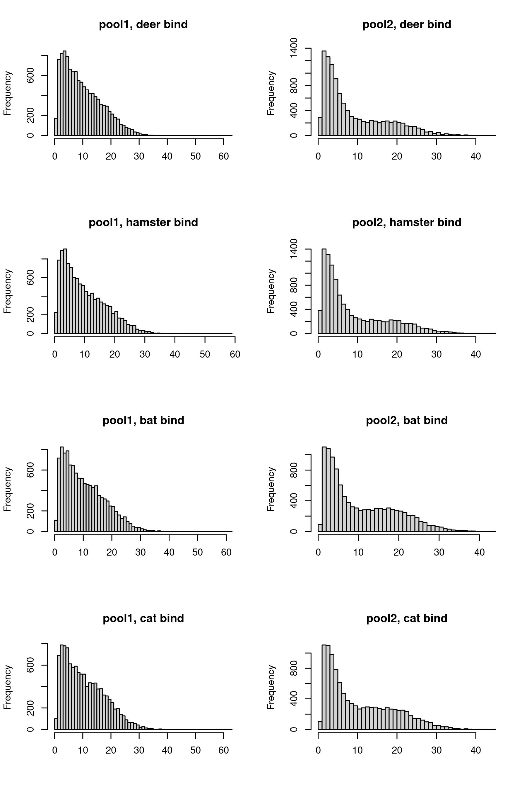
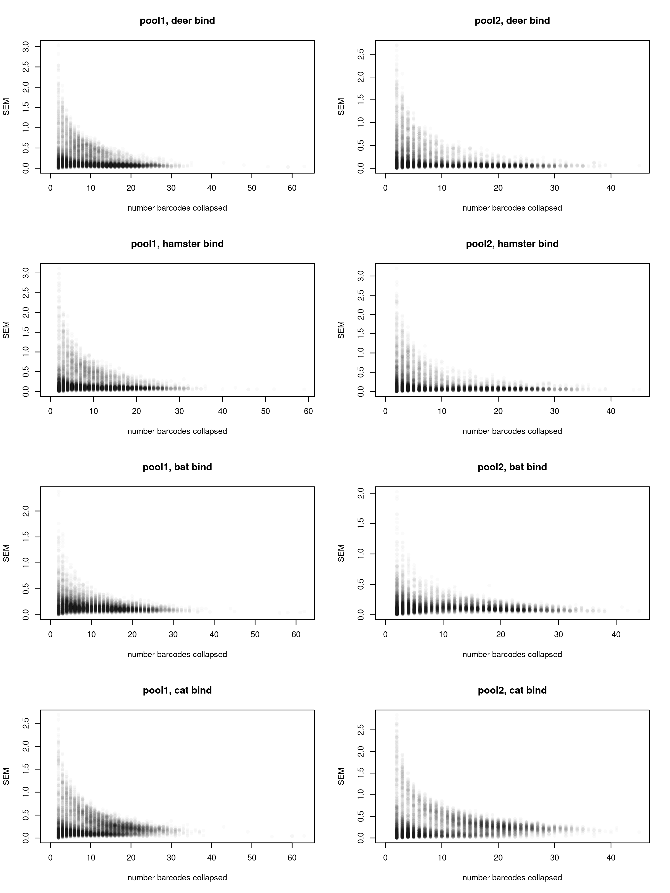
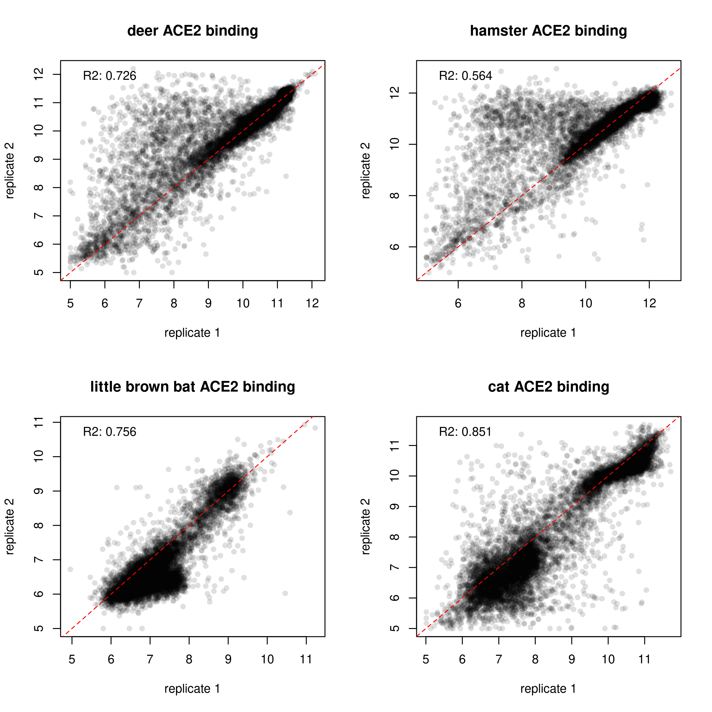
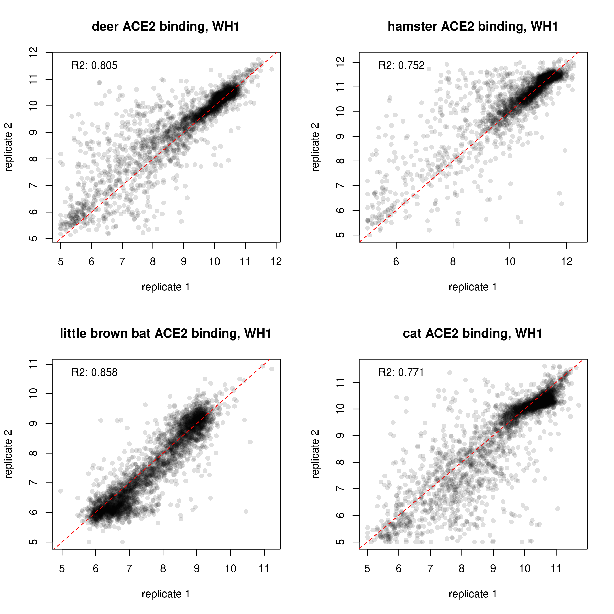
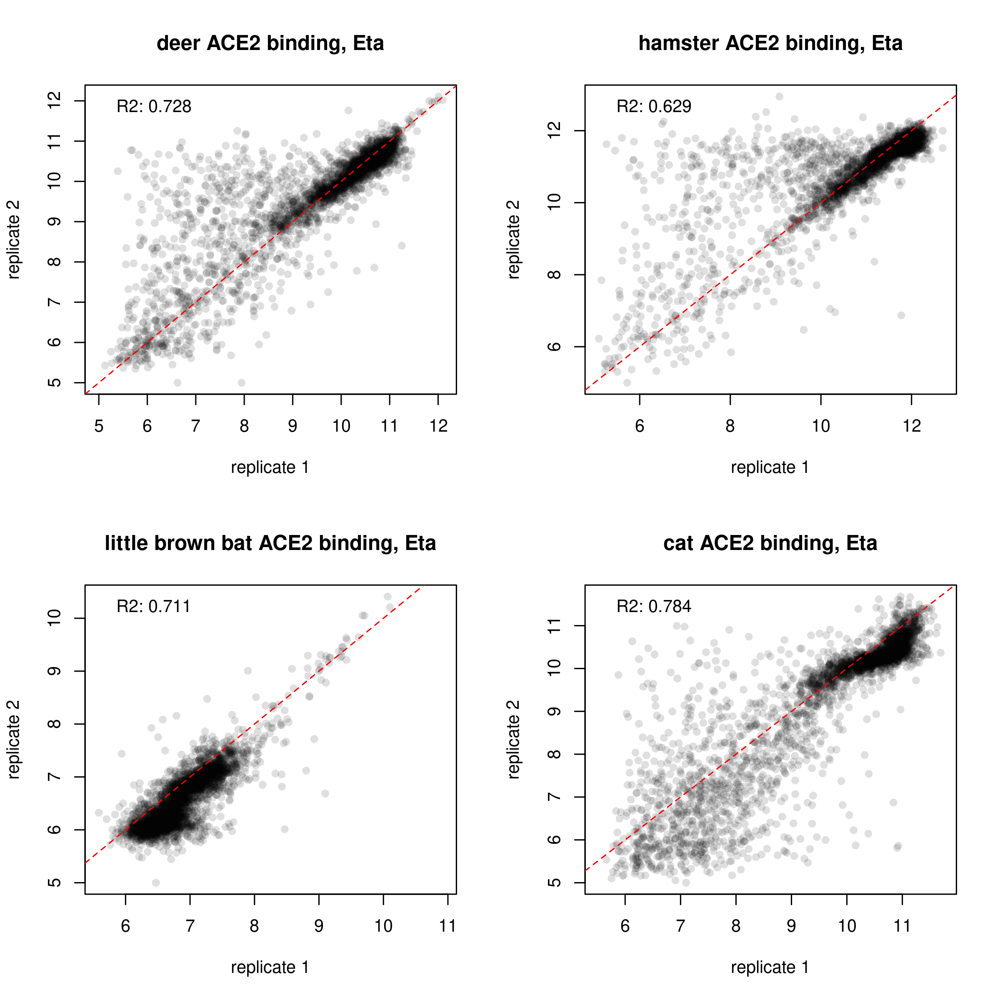
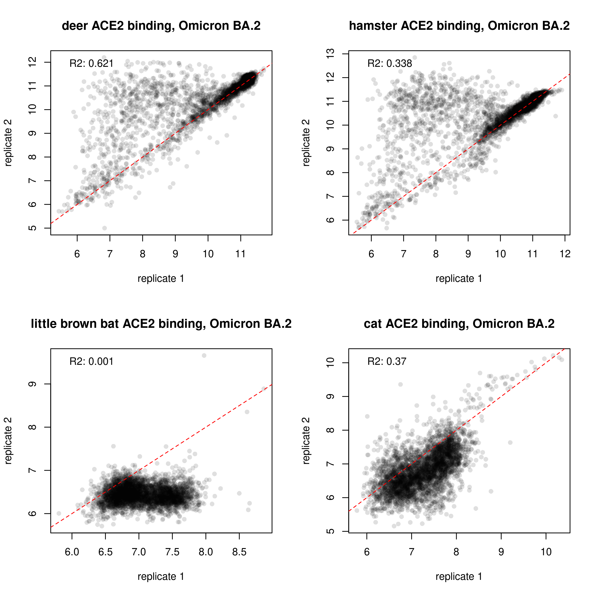
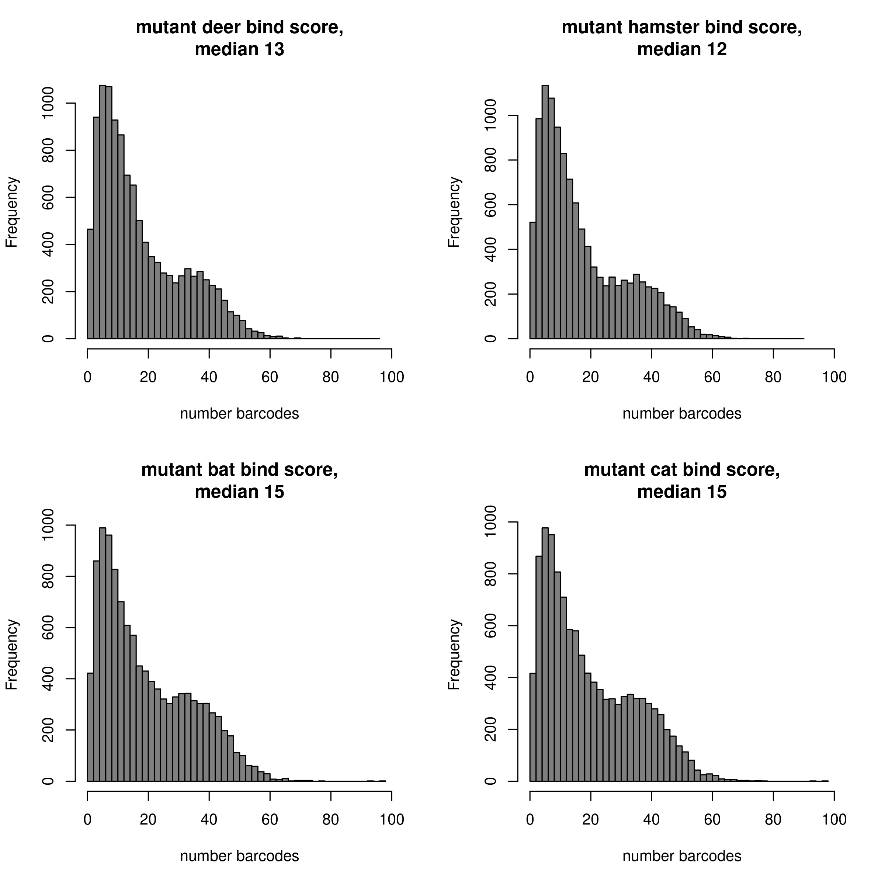
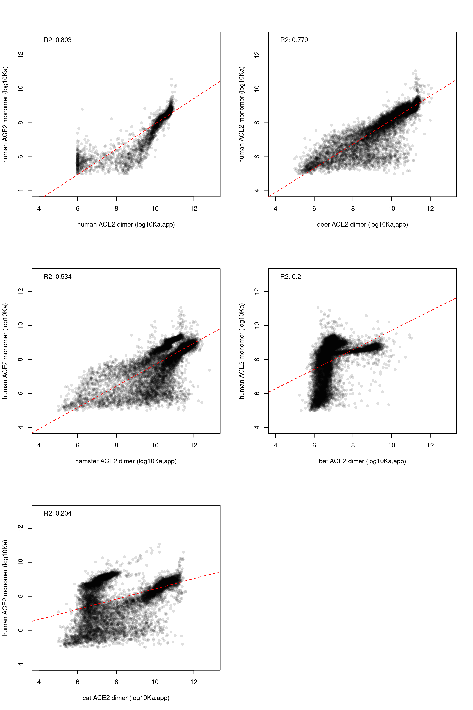

Collapse barcodes to final per-RBD/mutant phenotype scores
================
Tyler Starr
05/14/2023

- <a href="#setup" id="toc-setup">Setup</a>
- <a href="#calculate-per-variant-mean-scores-within-replicates"
  id="toc-calculate-per-variant-mean-scores-within-replicates">Calculate
  per-variant mean scores within replicates</a>
- <a href="#calculate-per-mutant-score-across-libraries"
  id="toc-calculate-per-mutant-score-across-libraries">Calculate
  per-mutant score across libraries</a>
- <a href="#correlations-among-backgrounds-and-to-prior-huace2-dms-data"
  id="toc-correlations-among-backgrounds-and-to-prior-huace2-dms-data">Correlations
  among backgrounds and to prior huACE2 DMS data</a>
- <a href="#heatmaps" id="toc-heatmaps">Heatmaps!</a>

This notebook reads in the per-barcode Kd measurements from the
`compute_xACE2_Kd` scripts. It synthesizes these per-ACE2 results into
the final ‘mean’ phenotypes of each mutant and integrates the prior
huACE2 measurements.

``` r
#list of packages to install/load
packages = c("yaml","data.table","tidyverse","gridExtra")
#install any packages not already installed
installed_packages <- packages %in% rownames(installed.packages())
if(any(installed_packages == F)){
  install.packages(packages[!installed_packages],
                   lib=c(paste("/uufs/chpc.utah.edu/common/home/",Sys.getenv("USER"),"/RLibs/",Sys.getenv("R_VERSION"),sep="")),
                   repos=c("http://cran.us.r-project.org"))
}
#load packages
invisible(lapply(packages, library, character.only=T))

knitr::opts_chunk$set(echo = T)
knitr::opts_chunk$set(dev.args = list(png = list(type = "cairo")))

#read in config file
config <- read_yaml("config.yaml")

#make output directory
if(!file.exists(config$final_variant_scores_dir)){
  dir.create(file.path(config$final_variant_scores_dir))
}
```

Session info for reproducing environment:

``` r
sessionInfo()
```

    ## R version 4.1.3 (2022-03-10)
    ## Platform: x86_64-pc-linux-gnu (64-bit)
    ## Running under: Rocky Linux 8.5 (Green Obsidian)
    ## 
    ## Matrix products: default
    ## BLAS/LAPACK: /uufs/chpc.utah.edu/sys/spack/linux-rocky8-nehalem/gcc-8.5.0/intel-oneapi-mkl-2021.4.0-h43nkmwzvaltaa6ii5l7n6e7ruvjbmnv/mkl/2021.4.0/lib/intel64/libmkl_rt.so.1
    ## 
    ## locale:
    ##  [1] LC_CTYPE=en_US.UTF-8       LC_NUMERIC=C              
    ##  [3] LC_TIME=en_US.UTF-8        LC_COLLATE=en_US.UTF-8    
    ##  [5] LC_MONETARY=en_US.UTF-8    LC_MESSAGES=en_US.UTF-8   
    ##  [7] LC_PAPER=en_US.UTF-8       LC_NAME=C                 
    ##  [9] LC_ADDRESS=C               LC_TELEPHONE=C            
    ## [11] LC_MEASUREMENT=en_US.UTF-8 LC_IDENTIFICATION=C       
    ## 
    ## attached base packages:
    ## [1] stats     graphics  grDevices utils     datasets  methods   base     
    ## 
    ## other attached packages:
    ##  [1] gridExtra_2.3     forcats_0.5.1     stringr_1.4.0     dplyr_1.0.8      
    ##  [5] purrr_0.3.4       readr_2.1.2       tidyr_1.2.0       tibble_3.1.6     
    ##  [9] ggplot2_3.4.1     tidyverse_1.3.1   data.table_1.14.2 yaml_2.3.5       
    ## 
    ## loaded via a namespace (and not attached):
    ##  [1] tidyselect_1.1.2 xfun_0.30        haven_2.4.3      colorspace_2.0-3
    ##  [5] vctrs_0.5.2      generics_0.1.2   htmltools_0.5.2  utf8_1.2.2      
    ##  [9] rlang_1.0.6      pillar_1.7.0     glue_1.6.2       withr_2.5.0     
    ## [13] DBI_1.1.2        dbplyr_2.1.1     modelr_0.1.8     readxl_1.3.1    
    ## [17] lifecycle_1.0.3  munsell_0.5.0    gtable_0.3.0     cellranger_1.1.0
    ## [21] rvest_1.0.2      evaluate_0.15    knitr_1.37       tzdb_0.2.0      
    ## [25] fastmap_1.1.0    fansi_1.0.2      broom_0.7.12     Rcpp_1.0.8      
    ## [29] backports_1.4.1  scales_1.2.1     jsonlite_1.8.4   fs_1.5.2        
    ## [33] hms_1.1.1        digest_0.6.29    stringi_1.7.6    grid_4.1.3      
    ## [37] cli_3.6.0        tools_4.1.3      magrittr_2.0.2   crayon_1.5.0    
    ## [41] pkgconfig_2.0.3  ellipsis_0.3.2   xml2_1.3.3       reprex_2.0.1    
    ## [45] lubridate_1.8.0  rstudioapi_0.13  assertthat_0.2.1 rmarkdown_2.13  
    ## [49] httr_1.4.6       R6_2.5.1         compiler_4.1.3

## Setup

Read in tables of per-barcode expression and binding Kd measurements and
combine.

``` r
dt_deer <- data.table(read.csv(config$deer_Kds_file),stringsAsFactors=F)
dt_hamster <- data.table(read.csv(config$hamster_Kds_file),stringsAsFactors=F)
dt_bat <- data.table(read.csv(config$bat_Kds_file),stringsAsFactors=F)
dt_cat <- data.table(read.csv(config$cat_Kds_file),stringsAsFactors=F)
```

## Calculate per-variant mean scores within replicates

Calculate the mean binding and expression score collapsed by genotype.
Also output the number of barcodes across which a variant score was
determined in each library.

``` r
#deer ACE2
dt_deer[is.na(log10Ka_deer),TiteSeq_deer_avgcount:=NA]
dt_deer[,mean_bind_deer:=mean(log10Ka_deer,na.rm=T),by=c("library","target","variant_class","aa_substitutions")]
dt_deer[,sd_bind_deer:=sd(log10Ka_deer,na.rm=T),by=c("library","target","variant_class","aa_substitutions")]
dt_deer[,n_bc_bind_deer:=sum(!is.na(log10Ka_deer)),by=c("library","target","variant_class","aa_substitutions")]
dt_deer[,avg_count_bind_deer:=mean(TiteSeq_deer_avgcount,na.rm=T),by=c("library","target","variant_class","aa_substitutions")]
dt_deer <- unique(dt_deer[,.(library,target,variant_class,aa_substitutions,n_aa_substitutions,mean_bind_deer,sd_bind_deer,n_bc_bind_deer,avg_count_bind_deer)])

#hamster ACE2
dt_hamster[is.na(log10Ka_hamster),TiteSeq_hamster_avgcount:=NA]
dt_hamster[,mean_bind_hamster:=mean(log10Ka_hamster,na.rm=T),by=c("library","target","variant_class","aa_substitutions")]
dt_hamster[,sd_bind_hamster:=sd(log10Ka_hamster,na.rm=T),by=c("library","target","variant_class","aa_substitutions")]
dt_hamster[,n_bc_bind_hamster:=sum(!is.na(log10Ka_hamster)),by=c("library","target","variant_class","aa_substitutions")]
dt_hamster[,avg_count_bind_hamster:=mean(TiteSeq_hamster_avgcount,na.rm=T),by=c("library","target","variant_class","aa_substitutions")]
dt_hamster <- unique(dt_hamster[,.(library,target,variant_class,aa_substitutions,n_aa_substitutions,mean_bind_hamster,sd_bind_hamster,n_bc_bind_hamster,avg_count_bind_hamster)])

#bat ACE2
dt_bat[is.na(log10Ka_bat),TiteSeq_bat_avgcount:=NA]
dt_bat[,mean_bind_bat:=mean(log10Ka_bat,na.rm=T),by=c("library","target","variant_class","aa_substitutions")]
dt_bat[,sd_bind_bat:=sd(log10Ka_bat,na.rm=T),by=c("library","target","variant_class","aa_substitutions")]
dt_bat[,n_bc_bind_bat:=sum(!is.na(log10Ka_bat)),by=c("library","target","variant_class","aa_substitutions")]
dt_bat[,avg_count_bind_bat:=mean(TiteSeq_bat_avgcount,na.rm=T),by=c("library","target","variant_class","aa_substitutions")]
dt_bat <- unique(dt_bat[,.(library,target,variant_class,aa_substitutions,n_aa_substitutions,mean_bind_bat,sd_bind_bat,n_bc_bind_bat,avg_count_bind_bat)])

#cat ACE2
dt_cat[is.na(log10Ka_cat),TiteSeq_cat_avgcount:=NA]
dt_cat[,mean_bind_cat:=mean(log10Ka_cat,na.rm=T),by=c("library","target","variant_class","aa_substitutions")]
dt_cat[,sd_bind_cat:=sd(log10Ka_cat,na.rm=T),by=c("library","target","variant_class","aa_substitutions")]
dt_cat[,n_bc_bind_cat:=sum(!is.na(log10Ka_cat)),by=c("library","target","variant_class","aa_substitutions")]
dt_cat[,avg_count_bind_cat:=mean(TiteSeq_cat_avgcount,na.rm=T),by=c("library","target","variant_class","aa_substitutions")]
dt_cat <- unique(dt_cat[,.(library,target,variant_class,aa_substitutions,n_aa_substitutions,mean_bind_cat,sd_bind_cat,n_bc_bind_cat,avg_count_bind_cat)])
```

Some QC plots. First, look at distribution of number barcodes for
binding measurements for single mutant detemrinations. These are
‘left-justified’ histograms, so the leftmost bar represents the number
of genotypes for which no barcodes were collapsed to final measurement
in a pool.

``` r
par(mfrow=c(4,2))

hist(dt_deer[library=="pool1" & variant_class=="1 nonsynonymous",n_bc_bind_deer],main="pool1, deer bind",right=F,breaks=max(dt_deer[library=="pool1" & variant_class=="1 nonsynonymous",n_bc_bind_deer],na.rm=T),xlab="")
hist(dt_deer[library=="pool2" & variant_class=="1 nonsynonymous",n_bc_bind_deer],main="pool2, deer bind",right=F,breaks=max(dt_deer[library=="pool2" & variant_class=="1 nonsynonymous",n_bc_bind_deer],na.rm=T),xlab="")

hist(dt_hamster[library=="pool1" & variant_class=="1 nonsynonymous",n_bc_bind_hamster],main="pool1, hamster bind",right=F,breaks=max(dt_hamster[library=="pool1" & variant_class=="1 nonsynonymous",n_bc_bind_hamster],na.rm=T),xlab="")
hist(dt_hamster[library=="pool2" & variant_class=="1 nonsynonymous",n_bc_bind_hamster],main="pool2, hamster bind",right=F,breaks=max(dt_hamster[library=="pool2" & variant_class=="1 nonsynonymous",n_bc_bind_hamster],na.rm=T),xlab="")

hist(dt_bat[library=="pool1" & variant_class=="1 nonsynonymous",n_bc_bind_bat],main="pool1, bat bind",right=F,breaks=max(dt_bat[library=="pool1" & variant_class=="1 nonsynonymous",n_bc_bind_bat],na.rm=T),xlab="")
hist(dt_bat[library=="pool2" & variant_class=="1 nonsynonymous",n_bc_bind_bat],main="pool2, bat bind",right=F,breaks=max(dt_bat[library=="pool2" & variant_class=="1 nonsynonymous",n_bc_bind_bat],na.rm=T),xlab="")

hist(dt_cat[library=="pool1" & variant_class=="1 nonsynonymous",n_bc_bind_cat],main="pool1, cat bind",right=F,breaks=max(dt_cat[library=="pool1" & variant_class=="1 nonsynonymous",n_bc_bind_cat],na.rm=T),xlab="")
hist(dt_cat[library=="pool2" & variant_class=="1 nonsynonymous",n_bc_bind_cat],main="pool2, cat bind",right=F,breaks=max(dt_cat[library=="pool2" & variant_class=="1 nonsynonymous",n_bc_bind_cat],na.rm=T),xlab="")
```



``` r
invisible(dev.print(pdf, paste(config$final_variant_scores_dir,"/histogram_n_bc_per_geno_sep-libs.pdf",sep=""),useDingbats=F))
```

What about how SEM tracks with number of barcodes collapsed? This could
help for choosing a minimum number of barcodes to use.

``` r
par(mfrow=c(4,2))
plot(dt_deer[library=="pool1" & variant_class=="1 nonsynonymous",n_bc_bind_deer],
     dt_deer[library=="pool1" & variant_class=="1 nonsynonymous",sd_bind_deer/sqrt(n_bc_bind_deer)],
     pch=16,col="#00000005",main="pool1, deer bind",ylab="SEM",xlab="number barcodes collapsed")
plot(dt_deer[library=="pool2" & variant_class=="1 nonsynonymous",n_bc_bind_deer],
     dt_deer[library=="pool2" & variant_class=="1 nonsynonymous",sd_bind_deer/sqrt(n_bc_bind_deer)],
     pch=16,col="#00000005",main="pool2, deer bind",ylab="SEM",xlab="number barcodes collapsed")

plot(dt_hamster[library=="pool1" & variant_class=="1 nonsynonymous",n_bc_bind_hamster],
     dt_hamster[library=="pool1" & variant_class=="1 nonsynonymous",sd_bind_hamster/sqrt(n_bc_bind_hamster)],
     pch=16,col="#00000005",main="pool1, hamster bind",ylab="SEM",xlab="number barcodes collapsed")
plot(dt_hamster[library=="pool2" & variant_class=="1 nonsynonymous",n_bc_bind_hamster],
     dt_hamster[library=="pool2" & variant_class=="1 nonsynonymous",sd_bind_hamster/sqrt(n_bc_bind_hamster)],
     pch=16,col="#00000005",main="pool2, hamster bind",ylab="SEM",xlab="number barcodes collapsed")

plot(dt_bat[library=="pool1" & variant_class=="1 nonsynonymous",n_bc_bind_bat],
     dt_bat[library=="pool1" & variant_class=="1 nonsynonymous",sd_bind_bat/sqrt(n_bc_bind_bat)],
     pch=16,col="#00000005",main="pool1, bat bind",ylab="SEM",xlab="number barcodes collapsed")
plot(dt_bat[library=="pool2" & variant_class=="1 nonsynonymous",n_bc_bind_bat],
     dt_bat[library=="pool2" & variant_class=="1 nonsynonymous",sd_bind_bat/sqrt(n_bc_bind_bat)],
     pch=16,col="#00000005",main="pool2, bat bind",ylab="SEM",xlab="number barcodes collapsed")

plot(dt_cat[library=="pool1" & variant_class=="1 nonsynonymous",n_bc_bind_cat],
     dt_cat[library=="pool1" & variant_class=="1 nonsynonymous",sd_bind_cat/sqrt(n_bc_bind_cat)],
     pch=16,col="#00000005",main="pool1, cat bind",ylab="SEM",xlab="number barcodes collapsed")
plot(dt_cat[library=="pool2" & variant_class=="1 nonsynonymous",n_bc_bind_cat],
     dt_cat[library=="pool2" & variant_class=="1 nonsynonymous",sd_bind_cat/sqrt(n_bc_bind_cat)],
     pch=16,col="#00000005",main="pool2, cat bind",ylab="SEM",xlab="number barcodes collapsed")
```



``` r
invisible(dev.print(pdf, paste(config$final_variant_scores_dir,"/sem_v_n-bc.pdf",sep=""),useDingbats=F))
```

Format into a ‘mutation lookup table’, where we focus just on the single
mutants (and wildtype), breakup the string of mutations, and fill in the
table to also include any missing mutants.

``` r
dt <- merge(merge(merge(dt_deer, dt_hamster), dt_bat), dt_cat)

dt_mutant <- dt[variant_class %in% "1 nonsynonymous",]

#split mutation string
#define function to apply
split_mut <- function(x){
  split <- strsplit(x,split="")[[1]]
  return(list(split[1],as.numeric(paste(split[2:(length(split)-1)],collapse="")),split[length(split)]))
}
dt_mutant[,c("wildtype","position","mutant"):=split_mut(as.character(aa_substitutions)),by=aa_substitutions]

dt_mutant <- dt_mutant[,.(library,target,wildtype,position,mutant,
                          mean_bind_deer,sd_bind_deer,n_bc_bind_deer,avg_count_bind_deer,
                          mean_bind_hamster,sd_bind_hamster,n_bc_bind_hamster,avg_count_bind_hamster,
                          mean_bind_bat,sd_bind_bat,n_bc_bind_bat,avg_count_bind_bat,
                          mean_bind_cat,sd_bind_cat,n_bc_bind_cat,avg_count_bind_cat)]

aas <- c("A","C","D","E","F","G","H","I","K","L","M","N","P","Q","R","S","T","V","W","Y")
#fill out missing values in table with a hideous loop, so the table is complete for all mutaitons (including those that are missing). If you are somebody who is reading this code, I apologize.
for(lib in c("pool1","pool2")){
  for(bg in as.character(unique(dt_mutant$target))){
    for(pos in 1:max(dt_mutant$position)){
      for(aa in aas){
        if(!(aa %in% as.character(dt_mutant[library==lib & target==bg & position==pos,mutant]))){
          dt_mutant <- rbind(dt_mutant,list(lib, bg, dt_mutant[target==bg & position==pos,wildtype][1],pos,aa),fill=T) #note this will leave NA for wildtype if a position is completely missing in both libraries
        }
      }
    }
  }
}
setkey(dt_mutant,library,target,position,mutant)

#fill in wildtype values -- should vectorize in data table but being so stupid so just going to write for loop
for(bg in unique(dt_mutant$target)){
  for(lib in c("pool1","pool2")){
    dt_mutant[library==lib & target==bg & wildtype==mutant, c("mean_bind_deer","sd_bind_deer","n_bc_bind_deer","avg_count_bind_deer",
                                                              "mean_bind_hamster","sd_bind_hamster","n_bc_bind_hamster","avg_count_bind_hamster",
                                                              "mean_bind_bat","sd_bind_bat","n_bc_bind_bat","avg_count_bind_bat",
                                                              "mean_bind_cat","sd_bind_cat","n_bc_bind_cat","avg_count_bind_cat") := 
                dt[library==lib & target==bg & variant_class=="wildtype",
                        .(mean_bind_deer,sd_bind_deer,n_bc_bind_deer,avg_count_bind_deer,
                          mean_bind_hamster,sd_bind_hamster,n_bc_bind_hamster,avg_count_bind_hamster,
                          mean_bind_bat,sd_bind_bat,n_bc_bind_bat,avg_count_bind_bat,
                          mean_bind_cat,sd_bind_cat,n_bc_bind_cat,avg_count_bind_cat)]]
  }
}

#add delta bind measures
for(bg in unique(dt_mutant$target)){
  for(lib in c("pool1","pool2")){
    ref_bind_deer <- dt[library==lib & target==bg & variant_class=="wildtype",mean_bind_deer]
    dt_mutant[library==lib & target==bg,delta_bind_deer := mean_bind_deer - ref_bind_deer]
    ref_bind_hamster <- dt[library==lib & target==bg & variant_class=="wildtype",mean_bind_hamster]
    dt_mutant[library==lib & target==bg,delta_bind_hamster := mean_bind_hamster - ref_bind_hamster]
    ref_bind_bat <- dt[library==lib & target==bg & variant_class=="wildtype",mean_bind_bat]
    dt_mutant[library==lib & target==bg,delta_bind_bat := mean_bind_bat - ref_bind_bat]
    ref_bind_cat <- dt[library==lib & target==bg & variant_class=="wildtype",mean_bind_cat]
    dt_mutant[library==lib & target==bg,delta_bind_cat := mean_bind_cat - ref_bind_cat]
  }
}
```

We have duplicates for each measurement. Let’s look at correlations!
First, pooling all three targets in one plot

``` r
par(mfrow=c(2,2))
x <- dt_mutant[library=="pool1" & wildtype!=mutant,mean_bind_deer]; y <- dt_mutant[library=="pool2" & wildtype!=mutant,mean_bind_deer]; plot(x,y,pch=16,col="#00000020",xlab="replicate 1",ylab="replicate 2",main="deer ACE2 binding");model <- lm(y~x);abline(a=0,b=1,lty=2,col="red");legend("topleft",legend=paste("R2: ",round(summary(model)$r.squared,3),sep=""),bty="n")

x <- dt_mutant[library=="pool1" & wildtype!=mutant,mean_bind_hamster]; y <- dt_mutant[library=="pool2" & wildtype!=mutant,mean_bind_hamster]; plot(x,y,pch=16,col="#00000020",xlab="replicate 1",ylab="replicate 2",main="hamster ACE2 binding");model <- lm(y~x);abline(a=0,b=1,lty=2,col="red");legend("topleft",legend=paste("R2: ",round(summary(model)$r.squared,3),sep=""),bty="n")

x <- dt_mutant[library=="pool1" & wildtype!=mutant,mean_bind_bat]; y <- dt_mutant[library=="pool2" & wildtype!=mutant,mean_bind_bat]; plot(x,y,pch=16,col="#00000020",xlab="replicate 1",ylab="replicate 2",main="little brown bat ACE2 binding");model <- lm(y~x);abline(a=0,b=1,lty=2,col="red");legend("topleft",legend=paste("R2: ",round(summary(model)$r.squared,3),sep=""),bty="n")

x <- dt_mutant[library=="pool1" & wildtype!=mutant,mean_bind_cat]; y <- dt_mutant[library=="pool2" & wildtype!=mutant,mean_bind_cat]; plot(x,y,pch=16,col="#00000020",xlab="replicate 1",ylab="replicate 2",main="cat ACE2 binding");model <- lm(y~x);abline(a=0,b=1,lty=2,col="red");legend("topleft",legend=paste("R2: ",round(summary(model)$r.squared,3),sep=""),bty="n")
```



``` r
invisible(dev.print(pdf, paste(config$final_variant_scores_dir,"/replicate_correlations.pdf",sep=""),useDingbats=F))
```

Correlations for WH1 background

``` r
par(mfrow=c(2,2))
x <- dt_mutant[library=="pool1" & target=="Wuhan_Hu_1" & wildtype!=mutant,mean_bind_deer]; y <- dt_mutant[library=="pool2" & target=="Wuhan_Hu_1" & wildtype!=mutant,mean_bind_deer]; plot(x,y,pch=16,col="#00000020",xlab="replicate 1",ylab="replicate 2",main="deer ACE2 binding, WH1");model <- lm(y~x);abline(a=0,b=1,lty=2,col="red");legend("topleft",legend=paste("R2: ",round(summary(model)$r.squared,3),sep=""),bty="n")

x <- dt_mutant[library=="pool1" & target=="Wuhan_Hu_1" & wildtype!=mutant,mean_bind_hamster]; y <- dt_mutant[library=="pool2" & target=="Wuhan_Hu_1" & wildtype!=mutant,mean_bind_hamster]; plot(x,y,pch=16,col="#00000020",xlab="replicate 1",ylab="replicate 2",main="hamster ACE2 binding, WH1");model <- lm(y~x);abline(a=0,b=1,lty=2,col="red");legend("topleft",legend=paste("R2: ",round(summary(model)$r.squared,3),sep=""),bty="n")

x <- dt_mutant[library=="pool1" & target=="Wuhan_Hu_1" & wildtype!=mutant,mean_bind_bat]; y <- dt_mutant[library=="pool2" & target=="Wuhan_Hu_1" & wildtype!=mutant,mean_bind_bat]; plot(x,y,pch=16,col="#00000020",xlab="replicate 1",ylab="replicate 2",main="little brown bat ACE2 binding, WH1");model <- lm(y~x);abline(a=0,b=1,lty=2,col="red");legend("topleft",legend=paste("R2: ",round(summary(model)$r.squared,3),sep=""),bty="n")

x <- dt_mutant[library=="pool1" & target=="Wuhan_Hu_1" & wildtype!=mutant,mean_bind_cat]; y <- dt_mutant[library=="pool2" & target=="Wuhan_Hu_1" & wildtype!=mutant,mean_bind_cat]; plot(x,y,pch=16,col="#00000020",xlab="replicate 1",ylab="replicate 2",main="cat ACE2 binding, WH1");model <- lm(y~x);abline(a=0,b=1,lty=2,col="red");legend("topleft",legend=paste("R2: ",round(summary(model)$r.squared,3),sep=""),bty="n")
```



``` r
invisible(dev.print(pdf, paste(config$final_variant_scores_dir,"/replicate_correlations_WH1.pdf",sep=""),useDingbats=F))
```

Correlations for Eta background

``` r
par(mfrow=c(2,2))
x <- dt_mutant[library=="pool1" & target=="E484K" & wildtype!=mutant,mean_bind_deer]; y <- dt_mutant[library=="pool2" & target=="E484K" & wildtype!=mutant,mean_bind_deer]; plot(x,y,pch=16,col="#00000020",xlab="replicate 1",ylab="replicate 2",main="deer ACE2 binding, Eta");model <- lm(y~x);abline(a=0,b=1,lty=2,col="red");legend("topleft",legend=paste("R2: ",round(summary(model)$r.squared,3),sep=""),bty="n")

x <- dt_mutant[library=="pool1" & target=="E484K" & wildtype!=mutant,mean_bind_hamster]; y <- dt_mutant[library=="pool2" & target=="E484K" & wildtype!=mutant,mean_bind_hamster]; plot(x,y,pch=16,col="#00000020",xlab="replicate 1",ylab="replicate 2",main="hamster ACE2 binding, Eta");model <- lm(y~x);abline(a=0,b=1,lty=2,col="red");legend("topleft",legend=paste("R2: ",round(summary(model)$r.squared,3),sep=""),bty="n")

x <- dt_mutant[library=="pool1" & target=="E484K" & wildtype!=mutant,mean_bind_bat]; y <- dt_mutant[library=="pool2" & target=="E484K" & wildtype!=mutant,mean_bind_bat]; plot(x,y,pch=16,col="#00000020",xlab="replicate 1",ylab="replicate 2",main="little brown bat ACE2 binding, Eta");model <- lm(y~x);abline(a=0,b=1,lty=2,col="red");legend("topleft",legend=paste("R2: ",round(summary(model)$r.squared,3),sep=""),bty="n")

x <- dt_mutant[library=="pool1" & target=="E484K" & wildtype!=mutant,mean_bind_cat]; y <- dt_mutant[library=="pool2" & target=="E484K" & wildtype!=mutant,mean_bind_cat]; plot(x,y,pch=16,col="#00000020",xlab="replicate 1",ylab="replicate 2",main="cat ACE2 binding, Eta");model <- lm(y~x);abline(a=0,b=1,lty=2,col="red");legend("topleft",legend=paste("R2: ",round(summary(model)$r.squared,3),sep=""),bty="n")
```



``` r
invisible(dev.print(pdf, paste(config$final_variant_scores_dir,"/replicate_correlations_Eta.pdf",sep=""),useDingbats=F))
```

Correlations for Omicron BA.2 background. For hamster and deer, seeing
lots of variants look like they have higher ACE2 affinity in rep2 bu
tlow in rep1. Taking a brief look through the mutations, it seems like
these mutants have more barcodes in rep1 and just 1 or 2 barcodes in
rep2, suggesting the rep2 measurement is the ‘errant’ one. Not sure why
this would happen, from a brief look it doesn’t look like an ACE2 mixup
pattern (but worth looking at this more carefully). Might need to look
at some of these with the interactive curve plots? Why weren’t there
more bcs with these mutations making it through in replicate 2? Some to
look back at include mutations F12Q, I88C, V181F (many more that can be
looked through, just wnated to note a few to circle back on). I have the
per-rep binding and n_bc metrics in the final data output file below so
I can look these mutations back up when going back to the titraiton fits
to see waht might be happening.

``` r
par(mfrow=c(2,2))
x <- dt_mutant[library=="pool1" & target=="BA2" & wildtype!=mutant,mean_bind_deer]; y <- dt_mutant[library=="pool2" & target=="BA2" & wildtype!=mutant,mean_bind_deer]; plot(x,y,pch=16,col="#00000020",xlab="replicate 1",ylab="replicate 2",main="deer ACE2 binding, Omicron BA.2");model <- lm(y~x);abline(a=0,b=1,lty=2,col="red");legend("topleft",legend=paste("R2: ",round(summary(model)$r.squared,3),sep=""),bty="n")

x <- dt_mutant[library=="pool1" & target=="BA2" & wildtype!=mutant,mean_bind_hamster]; y <- dt_mutant[library=="pool2" & target=="BA2" & wildtype!=mutant,mean_bind_hamster]; plot(x,y,pch=16,col="#00000020",xlab="replicate 1",ylab="replicate 2",main="hamster ACE2 binding, Omicron BA.2");model <- lm(y~x);abline(a=0,b=1,lty=2,col="red");legend("topleft",legend=paste("R2: ",round(summary(model)$r.squared,3),sep=""),bty="n")

x <- dt_mutant[library=="pool1" & target=="BA2" & wildtype!=mutant,mean_bind_bat]; y <- dt_mutant[library=="pool2" & target=="BA2" & wildtype!=mutant,mean_bind_bat]; plot(x,y,pch=16,col="#00000020",xlab="replicate 1",ylab="replicate 2",main="little brown bat ACE2 binding, Omicron BA.2");model <- lm(y~x);abline(a=0,b=1,lty=2,col="red");legend("topleft",legend=paste("R2: ",round(summary(model)$r.squared,3),sep=""),bty="n")

x <- dt_mutant[library=="pool1" & target=="BA2" & wildtype!=mutant,mean_bind_cat]; y <- dt_mutant[library=="pool2" & target=="BA2" & wildtype!=mutant,mean_bind_cat]; plot(x,y,pch=16,col="#00000020",xlab="replicate 1",ylab="replicate 2",main="cat ACE2 binding, Omicron BA.2");model <- lm(y~x);abline(a=0,b=1,lty=2,col="red");legend("topleft",legend=paste("R2: ",round(summary(model)$r.squared,3),sep=""),bty="n")
```



``` r
invisible(dev.print(pdf, paste(config$final_variant_scores_dir,"/replicate_correlations_BA2.pdf",sep=""),useDingbats=F))
```

## Calculate per-mutant score across libraries

Collapse down to mean from both replicates, and total n barcodes between
the two/three replicates. Also record the number of the replicates the
variant was quantified within. Note, we are currently keeping a value
even if it’s determined from a single bc fit in a single pool. Later on,
we may want to require some combination of minimum number of bcs within
or between libraries for retention. Another option (or a combo of both)
is to not take the mean of the per-replicate measurements, but rather
the mean across all barcodes (so if one value is the mean of 5 bcs, and
one is just 1 bc, the overall mean will be weighted toward the 5 as it’s
not collapse to replciate, then mean of replicate)

``` r
dt_final <- copy(dt_mutant)

dt_final[ ,bind_deer:=mean(mean_bind_deer,na.rm=T),by=c("target","position","mutant")]
dt_final[ ,delta_bind_deer:=mean(delta_bind_deer,na.rm=T),by=c("target","position","mutant")]
dt_final[ ,n_bc_deer:=sum(n_bc_bind_deer,na.rm=T),by=c("target","position","mutant")]
dt_final[ ,n_libs_deer:=sum(!is.na(mean_bind_deer)),by=c("target","position","mutant")]

dt_final[ ,bind_hamster:=mean(mean_bind_hamster,na.rm=T),by=c("target","position","mutant")]
dt_final[ ,delta_bind_hamster:=mean(delta_bind_hamster,na.rm=T),by=c("target","position","mutant")]
dt_final[ ,n_bc_hamster:=sum(n_bc_bind_hamster,na.rm=T),by=c("target","position","mutant")]
dt_final[ ,n_libs_hamster:=sum(!is.na(mean_bind_hamster)),by=c("target","position","mutant")]

dt_final[ ,bind_bat:=mean(mean_bind_bat,na.rm=T),by=c("target","position","mutant")]
dt_final[ ,delta_bind_bat:=mean(delta_bind_bat,na.rm=T),by=c("target","position","mutant")]
dt_final[ ,n_bc_bat:=sum(n_bc_bind_bat,na.rm=T),by=c("target","position","mutant")]
dt_final[ ,n_libs_bat:=sum(!is.na(mean_bind_bat)),by=c("target","position","mutant")]

dt_final[ ,bind_cat:=mean(mean_bind_cat,na.rm=T),by=c("target","position","mutant")]
dt_final[ ,delta_bind_cat:=mean(delta_bind_cat,na.rm=T),by=c("target","position","mutant")]
dt_final[ ,n_bc_cat:=sum(n_bc_bind_cat,na.rm=T),by=c("target","position","mutant")]
dt_final[ ,n_libs_cat:=sum(!is.na(mean_bind_cat)),by=c("target","position","mutant")]

#switch to spike indexing of postitions
dt_final$position <- dt_final$position + config$site_number_offset

#rename targets and set levels for plotting order
dt_final[target=="E484K",target:="Eta"]
dt_final[target=="BA2",target:="Omicron_BA2"]
dt_final[target=="Wuhan_Hu_1",target:="Wuhan-Hu-1"]
dt_final$target <- factor(dt_final$target,levels=c("Wuhan-Hu-1","Eta","Omicron_BA2"))

dt_final <- dt_final[target %in% c("Eta","Omicron_BA2","Wuhan-Hu-1")]

#add single mutation string
dt_final[,mutation:=paste(wildtype,position,mutant,sep=""),by=c("wildtype","position","mutant")]

dt_final <- unique(dt_final[,.(target,wildtype,position,mutant,mutation,
                               bind_deer,delta_bind_deer,n_bc_deer,n_libs_deer,
                               bind_hamster,delta_bind_hamster,n_bc_hamster,n_libs_hamster,
                               bind_bat,delta_bind_bat,n_bc_bat,n_libs_bat,
                               bind_cat,delta_bind_cat,n_bc_cat,n_libs_cat)])

setkey(dt_final,target,position,mutant)

#add the rep1 and rep2 sub-averages and bcs
dt_final[,deer_rep1 := dt_mutant[library=="pool1", mean_bind_deer]]
dt_final[,n_bc_deer_rep1 := dt_mutant[library=="pool1", n_bc_bind_deer]]
dt_final[,deer_rep2 := dt_mutant[library=="pool2", mean_bind_deer]]
dt_final[,n_bc_deer_rep2 := dt_mutant[library=="pool2", n_bc_bind_deer]]

dt_final[,hamster_rep1 := dt_mutant[library=="pool1", mean_bind_hamster]]
dt_final[,n_bc_hamster_rep1 := dt_mutant[library=="pool1", n_bc_bind_hamster]]
dt_final[,hamster_rep2 := dt_mutant[library=="pool2", mean_bind_hamster]]
dt_final[,n_bc_hamster_rep2 := dt_mutant[library=="pool2", n_bc_bind_hamster]]

dt_final[,bat_rep1 := dt_mutant[library=="pool1", mean_bind_bat]]
dt_final[,n_bc_bat_rep1 := dt_mutant[library=="pool1", n_bc_bind_bat]]
dt_final[,bat_rep2 := dt_mutant[library=="pool2", mean_bind_bat]]
dt_final[,n_bc_bat_rep2 := dt_mutant[library=="pool2", n_bc_bind_bat]]

dt_final[,cat_rep1 := dt_mutant[library=="pool1", mean_bind_cat]]
dt_final[,n_bc_cat_rep1 := dt_mutant[library=="pool1", n_bc_bind_cat]]
dt_final[,cat_rep2 := dt_mutant[library=="pool2", mean_bind_cat]]
dt_final[,n_bc_cat_rep2 := dt_mutant[library=="pool2", n_bc_bind_cat]]
```

Censor any measurements that are from \<3 bc or only sampled in a single
replicate? Don’t do this for now.

``` r
# min_bc <- 2
# min_lib <- 2
# 
# dt_final[n_bc_bind < min_bc & n_libs_bind < min_lib, c("bind","delta_bind","n_bc_bind","n_libs_bind") := list(NA,NA,NA,NA)]
# dt_final[n_bc_expr < min_bc & n_libs_expr < min_lib, c("expr","delta_expr","n_bc_expr","n_libs_expr") := list(NA,NA,NA,NA)]
```

Coverage stats on n_barcodes for different measurements in the final
pooled measurements.

``` r
par(mfrow=c(2,2))
hist(dt_final[wildtype!=mutant, n_bc_deer],col="gray50",main=paste("mutant deer bind score,\nmedian ",median(dt_final[wildtype!=mutant, n_bc_deer],na.rm=T),sep=""),right=F,breaks=max(c(dt_final[wildtype!=mutant, n_bc_deer],dt_final[wildtype!=mutant, n_bc_hamster],dt_final[wildtype!=mutant, n_bc_bat]))/2,xlab="number barcodes", xlim=c(0,100))

hist(dt_final[wildtype!=mutant, n_bc_hamster],col="gray50",main=paste("mutant hamster bind score,\nmedian ",median(dt_final[wildtype!=mutant, n_bc_hamster],na.rm=T),sep=""),right=F,breaks=max(c(dt_final[wildtype!=mutant, n_bc_deer],dt_final[wildtype!=mutant, n_bc_hamster],dt_final[wildtype!=mutant, n_bc_bat]))/2,xlab="number barcodes", xlim=c(0,100))

hist(dt_final[wildtype!=mutant, n_bc_bat],col="gray50",main=paste("mutant bat bind score,\nmedian ",median(dt_final[wildtype!=mutant, n_bc_bat],na.rm=T),sep=""),right=F,breaks=max(c(dt_final[wildtype!=mutant, n_bc_deer],dt_final[wildtype!=mutant, n_bc_hamster],dt_final[wildtype!=mutant, n_bc_bat]))/2,xlab="number barcodes", xlim=c(0,100))

hist(dt_final[wildtype!=mutant, n_bc_cat],col="gray50",main=paste("mutant cat bind score,\nmedian ",median(dt_final[wildtype!=mutant, n_bc_cat],na.rm=T),sep=""),right=F,breaks=max(c(dt_final[wildtype!=mutant, n_bc_cat],dt_final[wildtype!=mutant, n_bc_hamster],dt_final[wildtype!=mutant, n_bc_bat]))/2,xlab="number barcodes", xlim=c(0,100))
```



``` r
invisible(dev.print(pdf, paste(config$final_variant_scores_dir,"/histogram_n_bc_per_geno_pooled-libs.pdf",sep="")))
```

## Correlations among backgrounds and to prior huACE2 DMS data

``` r
dt_og_dimer <- data.table(read.csv(file=config$`mut_bind-dimer_expr`,stringsAsFactors = F))
dt_og_monomer <- data.table(read.csv(file=config$`mut_bind-monomer_expr`,stringsAsFactors = F))

dt_og_dimer$delta_bind_human <- dt_og_dimer$bind_avg
dt_og_dimer[,bind_human:=bind_avg+10.79]
dt_og_dimer[,target:="Wuhan-Hu-1"]

#use the omicron-assocaited wh1 dataset
dt_og_monomer[target=="Wuhan-Hu-1_v1",target:="Wuhan-Hu-1"]

dt_final[,bind_human_monomer:=as.numeric(NA)]
dt_final[,delta_bind_human_monomer:=as.numeric(NA)]
dt_final[,bind_human_dimer:=as.numeric(NA)]
dt_final[,delta_bind_human_dimer:=as.numeric(NA)]

for(i in 1:nrow(dt_final)){
  if(dt_final[i,target]=="Wuhan-Hu-1"){
    dt_final[i,"bind_human_dimer"] <- dt_og_dimer[target==dt_final[i,target] & site_SARS2==dt_final[i,position] & mutant==dt_final[i,mutant],bind_human]
    dt_final[i,"delta_bind_human_dimer"] <- dt_og_dimer[target==dt_final[i,target] & site_SARS2==dt_final[i,position] & mutant==dt_final[i,mutant],delta_bind_human]
  }
  dt_final[i,"bind_human_monomer"] <- dt_og_monomer[target==dt_final[i,target] & position==dt_final[i,position] & mutant==dt_final[i,mutant],bind]
  dt_final[i,"delta_bind_human_monomer"] <- dt_og_monomer[target==dt_final[i,target] & position==dt_final[i,position] & mutant==dt_final[i,mutant],delta_bind]
  dt_final[i,"expr"] <- dt_og_monomer[target==dt_final[i,target] & position==dt_final[i,position] & mutant==dt_final[i,mutant],expr]
  dt_final[i,"delta_expr"] <- dt_og_monomer[target==dt_final[i,target] & position==dt_final[i,position] & mutant==dt_final[i,mutant],delta_expr]
}
```

Look at correlations in mutation effects between each background and
huACE2, for bind phenotype

``` r
par(mfrow=c(3,2))

x <- dt_final[,bind_human_dimer]; y <- dt_final[,bind_human_monomer]; plot(x,y,pch=16,col="#00000020",xlab="human ACE2 dimer (log10Ka,app)",ylab="human ACE2 monomer (log10Ka)",main="", xlim=c(4,13),ylim=c(4,13));model <- lm(y~x);abline(model,lty=2,col="red");legend("topleft",legend=paste("R2: ",round(summary(model)$r.squared,3),sep=""),bty="n")

x <- dt_final[,bind_deer]; y <- dt_final[,bind_human_monomer]; plot(x,y,pch=16,col="#00000020",xlab="deer ACE2 dimer (log10Ka,app)",ylab="human ACE2 monomer (log10Ka)",main="", xlim=c(4,13),ylim=c(4,13));model <- lm(y~x);abline(model,lty=2,col="red");legend("topleft",legend=paste("R2: ",round(summary(model)$r.squared,3),sep=""),bty="n")

x <- dt_final[,bind_hamster]; y <- dt_final[,bind_human_monomer]; plot(x,y,pch=16,col="#00000020",xlab="hamster ACE2 dimer (log10Ka,app)",ylab="human ACE2 monomer (log10Ka)",main="", xlim=c(4,13),ylim=c(4,13));model <- lm(y~x);abline(model,lty=2,col="red");legend("topleft",legend=paste("R2: ",round(summary(model)$r.squared,3),sep=""),bty="n")

x <- dt_final[,bind_bat]; y <- dt_final[,bind_human_monomer]; plot(x,y,pch=16,col="#00000020",xlab="bat ACE2 dimer (log10Ka,app)",ylab="human ACE2 monomer (log10Ka)",main="", xlim=c(4,13),ylim=c(4,13));model <- lm(y~x);abline(model,lty=2,col="red");legend("topleft",legend=paste("R2: ",round(summary(model)$r.squared,3),sep=""),bty="n")

x <- dt_final[,bind_cat]; y <- dt_final[,bind_human_monomer]; plot(x,y,pch=16,col="#00000020",xlab="cat ACE2 dimer (log10Ka,app)",ylab="human ACE2 monomer (log10Ka)",main="", xlim=c(4,13),ylim=c(4,13));model <- lm(y~x);abline(model,lty=2,col="red");legend("topleft",legend=paste("R2: ",round(summary(model)$r.squared,3),sep=""),bty="n")

invisible(dev.print(pdf, paste(config$final_variant_scores_dir,"/background_correlations_bind.pdf",sep=""),useDingbats=F))
```



## Heatmaps!

Order factor variables for plotting

``` r
#order mutant as a factor for grouping by rough biochemical grouping
dt_final$mutant <- factor(dt_final$mutant, levels=c("C","P","G","V","M","L","I","A","F","W","Y","T","S","N","Q","E","D","H","K","R"))
#add character vector indicating wildtype to use as plotting symbols for wt
dt_final[,wildtype_indicator := ""]
dt_final[as.character(mutant)==as.character(wildtype),wildtype_indicator := "x"]

#make temp long-form data frame
temp <- data.table::melt(dt_final[, .(target,position,mutant,
                                      bind_deer,delta_bind_deer,
                                      bind_hamster,delta_bind_hamster,
                                      bind_bat,delta_bind_bat,
                                      bind_cat,delta_bind_cat,
                                      bind_human_monomer,delta_bind_human_monomer,
                                      bind_human_dimer,delta_bind_human_dimer,
                                      wildtype_indicator)],
                         id.vars=c("target","position","mutant","wildtype_indicator"),
                         measure.vars=c("bind_deer","delta_bind_deer",
                                        "bind_hamster","delta_bind_hamster",
                                        "bind_bat","delta_bind_bat",
                                        "bind_cat","delta_bind_cat",
                                        "bind_human_monomer","delta_bind_human_monomer",
                                        "bind_human_dimer","delta_bind_human_dimer"),
                         variable.name="measurement",value.name="value")

#for method to duplicate aa labels on right side of plot https://github.com/tidyverse/ggplot2/issues/3171
guide_axis_label_trans <- function(label_trans = identity, ...) {
  axis_guide <- guide_axis(...)
  axis_guide$label_trans <- rlang::as_function(label_trans)
  class(axis_guide) <- c("guide_axis_trans", class(axis_guide))
  axis_guide
}

guide_train.guide_axis_trans <- function(x, ...) {
  trained <- NextMethod()
  trained$key$.label <- x$label_trans(trained$key$.label)
  trained
}
```

Make heatmaps showing raw affinity and delta-affinity of muts relative
to wildtype for each of the ACE2s. First, log10Ka for deer ACE2

``` r
p1 <- ggplot(temp[measurement=="bind_deer",],aes(position,mutant))+geom_tile(aes(fill=value),color="black",lwd=0.1)+
  scale_fill_gradientn(colours=c("#FFFFFF","#003366"),limits=c(5,13),na.value="gray60")+
  #scale_fill_gradientn(colours=c("#FFFFFF","#FFFFFF","#003366"),limits=c(5,12),values=c(0,1/7,7/7),na.value="yellow")+ #three notches in case I want to 'censor' closer to the 5 boundary condition
  scale_x_continuous(expand=c(0,0),breaks=c(331,seq(335,530,by=5)))+
  labs(x="",y="")+theme_classic(base_size=9)+
  coord_equal()+theme(axis.text.x=element_text(angle=90,hjust=1,vjust=0.6,face="bold",size=10),axis.text.y=element_text(face="bold",size=10))+
  facet_wrap(~target,nrow=5)+
  guides(y.sec=guide_axis_label_trans())+
  geom_text(aes(label=wildtype_indicator),size=2,color="gray10")+
  theme(strip.text.x = element_text(size = 18))

p1
```


``` r
invisible(dev.print(pdf, paste(config$final_variant_scores_dir,"/heatmap_deer_log10Ka.pdf",sep="")))
```

Second, illustrating delta_log10Ka for deer

``` r
p1 <- ggplot(temp[measurement=="delta_bind_deer",],aes(position,mutant))+geom_tile(aes(fill=value),color="black",lwd=0.1)+
  scale_fill_gradientn(colours=c("#A94E35","#A94E35","#F48365","#FFFFFF","#7378B9","#383C6C"),limits=c(-7,3),values=c(0/10, 4/10, 5.5/10, 7/10, 8.5/10, 10/10),na.value="gray60")+ #effective coloring from -3 to +3
  scale_x_continuous(expand=c(0,0),breaks=c(331,seq(335,530,by=5)))+
  labs(x="",y="")+theme_classic(base_size=9)+
  coord_equal()+theme(axis.text.x=element_text(angle=90,hjust=1,vjust=0.6,face="bold",size=10),axis.text.y=element_text(face="bold",size=10))+
  facet_wrap(~target,nrow=5)+
  guides(y.sec=guide_axis_label_trans())+
  geom_text(aes(label=wildtype_indicator),size=2,color="gray10")+
  theme(strip.text.x = element_text(size = 18))

p1
```


``` r
invisible(dev.print(pdf, paste(config$final_variant_scores_dir,"/heatmap_deer_delta-log10Ka.pdf",sep="")))
```

Next, absolute log10Ka for hamster ACE2

``` r
p1 <- ggplot(temp[measurement=="bind_hamster",],aes(position,mutant))+geom_tile(aes(fill=value),color="black",lwd=0.1)+
  scale_fill_gradientn(colours=c("#FFFFFF","#003366"),limits=c(5,13),na.value="gray60")+
  #scale_fill_gradientn(colours=c("#FFFFFF","#FFFFFF","#003366"),limits=c(5,12),values=c(0,1/7,7/7),na.value="yellow")+ #three notches in case I want to 'censor' closer to the 5 boundary condition
  scale_x_continuous(expand=c(0,0),breaks=c(331,seq(335,530,by=5)))+
  labs(x="",y="")+theme_classic(base_size=9)+
  coord_equal()+theme(axis.text.x=element_text(angle=90,hjust=1,vjust=0.6,face="bold",size=10),axis.text.y=element_text(face="bold",size=10))+
  facet_wrap(~target,nrow=5)+
  guides(y.sec=guide_axis_label_trans())+
  geom_text(aes(label=wildtype_indicator),size=2,color="gray10")+
  theme(strip.text.x = element_text(size = 18))

p1
```


``` r
invisible(dev.print(pdf, paste(config$final_variant_scores_dir,"/heatmap_hamster_log10Ka.pdf",sep="")))
```

Delta_log10Ka for hamster

``` r
p1 <- ggplot(temp[measurement=="delta_bind_hamster",],aes(position,mutant))+geom_tile(aes(fill=value),color="black",lwd=0.1)+
  scale_fill_gradientn(colours=c("#A94E35","#A94E35","#F48365","#FFFFFF","#7378B9","#383C6C"),limits=c(-7,3),values=c(0/10, 4/10, 5.5/10, 7/10, 8.5/10, 10/10),na.value="gray60")+ #effective coloring from -3 to +3
  scale_x_continuous(expand=c(0,0),breaks=c(331,seq(335,530,by=5)))+
  labs(x="",y="")+theme_classic(base_size=9)+
  coord_equal()+theme(axis.text.x=element_text(angle=90,hjust=1,vjust=0.6,face="bold",size=10),axis.text.y=element_text(face="bold",size=10))+
  facet_wrap(~target,nrow=5)+
  guides(y.sec=guide_axis_label_trans())+
  geom_text(aes(label=wildtype_indicator),size=2,color="gray10")+
  theme(strip.text.x = element_text(size = 18))

p1
```


``` r
invisible(dev.print(pdf, paste(config$final_variant_scores_dir,"/heatmap_hamster_delta-log10Ka.pdf",sep="")))
```

Next, absolute log10Ka for bat ACE2

``` r
p1 <- ggplot(temp[measurement=="bind_bat",],aes(position,mutant))+geom_tile(aes(fill=value),color="black",lwd=0.1)+
  scale_fill_gradientn(colours=c("#FFFFFF","#003366"),limits=c(5,13),na.value="gray60")+
  #scale_fill_gradientn(colours=c("#FFFFFF","#FFFFFF","#003366"),limits=c(5,12),values=c(0,1/7,7/7),na.value="yellow")+ #three notches in case I want to 'censor' closer to the 5 boundary condition
  scale_x_continuous(expand=c(0,0),breaks=c(331,seq(335,530,by=5)))+
  labs(x="",y="")+theme_classic(base_size=9)+
  coord_equal()+theme(axis.text.x=element_text(angle=90,hjust=1,vjust=0.6,face="bold",size=10),axis.text.y=element_text(face="bold",size=10))+
  facet_wrap(~target,nrow=5)+
  guides(y.sec=guide_axis_label_trans())+
  geom_text(aes(label=wildtype_indicator),size=2,color="gray10")+
  theme(strip.text.x = element_text(size = 18))

p1
```


``` r
invisible(dev.print(pdf, paste(config$final_variant_scores_dir,"/heatmap_bat_log10Ka.pdf",sep="")))
```

Delta_log10Ka for bat

``` r
p1 <- ggplot(temp[measurement=="delta_bind_bat",],aes(position,mutant))+geom_tile(aes(fill=value),color="black",lwd=0.1)+
  scale_fill_gradientn(colours=c("#A94E35","#A94E35","#F48365","#FFFFFF","#7378B9","#383C6C"),limits=c(-7,3),values=c(0/10, 4/10, 5.5/10, 7/10, 8.5/10, 10/10),na.value="gray60")+ #effective coloring from -3 to +3
  scale_x_continuous(expand=c(0,0),breaks=c(331,seq(335,530,by=5)))+
  labs(x="",y="")+theme_classic(base_size=9)+
  coord_equal()+theme(axis.text.x=element_text(angle=90,hjust=1,vjust=0.6,face="bold",size=10),axis.text.y=element_text(face="bold",size=10))+
  facet_wrap(~target,nrow=5)+
  guides(y.sec=guide_axis_label_trans())+
  geom_text(aes(label=wildtype_indicator),size=2,color="gray10")+
  theme(strip.text.x = element_text(size = 18))

p1
```


``` r
invisible(dev.print(pdf, paste(config$final_variant_scores_dir,"/heatmap_bat_delta-log10Ka.pdf",sep="")))
```

Next, absolute log10Ka for cat ACE2

``` r
p1 <- ggplot(temp[measurement=="bind_cat",],aes(position,mutant))+geom_tile(aes(fill=value),color="black",lwd=0.1)+
  scale_fill_gradientn(colours=c("#FFFFFF","#003366"),limits=c(5,13),na.value="gray60")+
  #scale_fill_gradientn(colours=c("#FFFFFF","#FFFFFF","#003366"),limits=c(5,12),values=c(0,1/7,7/7),na.value="yellow")+ #three notches in case I want to 'censor' closer to the 5 boundary condition
  scale_x_continuous(expand=c(0,0),breaks=c(331,seq(335,530,by=5)))+
  labs(x="",y="")+theme_classic(base_size=9)+
  coord_equal()+theme(axis.text.x=element_text(angle=90,hjust=1,vjust=0.6,face="bold",size=10),axis.text.y=element_text(face="bold",size=10))+
  facet_wrap(~target,nrow=5)+
  guides(y.sec=guide_axis_label_trans())+
  geom_text(aes(label=wildtype_indicator),size=2,color="gray10")+
  theme(strip.text.x = element_text(size = 18))

p1
```


``` r
invisible(dev.print(pdf, paste(config$final_variant_scores_dir,"/heatmap_cat_log10Ka.pdf",sep="")))
```

Delta_log10Ka for cat

``` r
p1 <- ggplot(temp[measurement=="delta_bind_cat",],aes(position,mutant))+geom_tile(aes(fill=value),color="black",lwd=0.1)+
  scale_fill_gradientn(colours=c("#A94E35","#A94E35","#F48365","#FFFFFF","#7378B9","#383C6C"),limits=c(-7,3),values=c(0/10, 4/10, 5.5/10, 7/10, 8.5/10, 10/10),na.value="gray60")+ #effective coloring from -3 to +3
  scale_x_continuous(expand=c(0,0),breaks=c(331,seq(335,530,by=5)))+
  labs(x="",y="")+theme_classic(base_size=9)+
  coord_equal()+theme(axis.text.x=element_text(angle=90,hjust=1,vjust=0.6,face="bold",size=10),axis.text.y=element_text(face="bold",size=10))+
  facet_wrap(~target,nrow=5)+
  guides(y.sec=guide_axis_label_trans())+
  geom_text(aes(label=wildtype_indicator),size=2,color="gray10")+
  theme(strip.text.x = element_text(size = 18))

p1
```


``` r
invisible(dev.print(pdf, paste(config$final_variant_scores_dir,"/heatmap_cat_delta-log10Ka.pdf",sep="")))
```

Next, absolute log10Ka for human_monomer ACE2

``` r
p1 <- ggplot(temp[measurement=="bind_human_monomer",],aes(position,mutant))+geom_tile(aes(fill=value),color="black",lwd=0.1)+
  scale_fill_gradientn(colours=c("#FFFFFF","#003366"),limits=c(5,13),na.value="gray60")+
  #scale_fill_gradientn(colours=c("#FFFFFF","#FFFFFF","#003366"),limits=c(5,12),values=c(0,1/7,7/7),na.value="yellow")+ #three notches in case I want to 'censor' closer to the 5 boundary condition
  scale_x_continuous(expand=c(0,0),breaks=c(331,seq(335,530,by=5)))+
  labs(x="",y="")+theme_classic(base_size=9)+
  coord_equal()+theme(axis.text.x=element_text(angle=90,hjust=1,vjust=0.6,face="bold",size=10),axis.text.y=element_text(face="bold",size=10))+
  facet_wrap(~target,nrow=5)+
  guides(y.sec=guide_axis_label_trans())+
  geom_text(aes(label=wildtype_indicator),size=2,color="gray10")+
  theme(strip.text.x = element_text(size = 18))

p1
```


``` r
invisible(dev.print(pdf, paste(config$final_variant_scores_dir,"/heatmap_human_monomer_log10Ka.pdf",sep="")))
```

Delta_log10Ka for human_monomer

``` r
p1 <- ggplot(temp[measurement=="delta_bind_human_monomer",],aes(position,mutant))+geom_tile(aes(fill=value),color="black",lwd=0.1)+
  scale_fill_gradientn(colours=c("#A94E35","#A94E35","#F48365","#FFFFFF","#7378B9","#383C6C"),limits=c(-7,3),values=c(0/10, 4/10, 5.5/10, 7/10, 8.5/10, 10/10),na.value="gray60")+ #effective coloring from -3 to +3
  scale_x_continuous(expand=c(0,0),breaks=c(331,seq(335,530,by=5)))+
  labs(x="",y="")+theme_classic(base_size=9)+
  coord_equal()+theme(axis.text.x=element_text(angle=90,hjust=1,vjust=0.6,face="bold",size=10),axis.text.y=element_text(face="bold",size=10))+
  facet_wrap(~target,nrow=5)+
  guides(y.sec=guide_axis_label_trans())+
  geom_text(aes(label=wildtype_indicator),size=2,color="gray10")+
  theme(strip.text.x = element_text(size = 18))

p1
```


``` r
invisible(dev.print(pdf, paste(config$final_variant_scores_dir,"/heatmap_human_monomer_delta-log10Ka.pdf",sep="")))
```

Next, absolute log10Ka for human_dimer ACE2

``` r
p1 <- ggplot(temp[measurement=="bind_human_dimer",],aes(position,mutant))+geom_tile(aes(fill=value),color="black",lwd=0.1)+
  scale_fill_gradientn(colours=c("#FFFFFF","#003366"),limits=c(5,13),na.value="gray60")+
  #scale_fill_gradientn(colours=c("#FFFFFF","#FFFFFF","#003366"),limits=c(5,12),values=c(0,1/7,7/7),na.value="yellow")+ #three notches in case I want to 'censor' closer to the 5 boundary condition
  scale_x_continuous(expand=c(0,0),breaks=c(331,seq(335,530,by=5)))+
  labs(x="",y="")+theme_classic(base_size=9)+
  coord_equal()+theme(axis.text.x=element_text(angle=90,hjust=1,vjust=0.6,face="bold",size=10),axis.text.y=element_text(face="bold",size=10))+
  facet_wrap(~target,nrow=5)+
  guides(y.sec=guide_axis_label_trans())+
  geom_text(aes(label=wildtype_indicator),size=2,color="gray10")+
  theme(strip.text.x = element_text(size = 18))

p1
```


``` r
invisible(dev.print(pdf, paste(config$final_variant_scores_dir,"/heatmap_human_dimer_log10Ka.pdf",sep="")))
```

Delta_log10Ka for human_dimer

``` r
p1 <- ggplot(temp[measurement=="delta_bind_human_dimer",],aes(position,mutant))+geom_tile(aes(fill=value),color="black",lwd=0.1)+
  scale_fill_gradientn(colours=c("#A94E35","#A94E35","#F48365","#FFFFFF","#7378B9","#383C6C"),limits=c(-7,3),values=c(0/10, 4/10, 5.5/10, 7/10, 8.5/10, 10/10),na.value="gray60")+ #effective coloring from -3 to +3
  scale_x_continuous(expand=c(0,0),breaks=c(331,seq(335,530,by=5)))+
  labs(x="",y="")+theme_classic(base_size=9)+
  coord_equal()+theme(axis.text.x=element_text(angle=90,hjust=1,vjust=0.6,face="bold",size=10),axis.text.y=element_text(face="bold",size=10))+
  facet_wrap(~target,nrow=5)+
  guides(y.sec=guide_axis_label_trans())+
  geom_text(aes(label=wildtype_indicator),size=2,color="gray10")+
  theme(strip.text.x = element_text(size = 18))

p1
```


``` r
invisible(dev.print(pdf, paste(config$final_variant_scores_dir,"/heatmap_human_dimer_delta-log10Ka.pdf",sep="")))
```

Then, the other grouping for heatmaps is, for each background, faceted
heatmaps for each ACE2

Wuhan-Hu-1, absolute affinities

``` r
p1 <- ggplot(temp[target=="Wuhan-Hu-1" & measurement %in% c("bind_deer","bind_hamster","bind_bat","bind_cat","bind_human_monomer","bind_human_dimer"),],aes(position,mutant))+geom_tile(aes(fill=value),color="black",lwd=0.1)+
  scale_fill_gradientn(colours=c("#FFFFFF","#003366"),limits=c(5,13),na.value="gray60")+
  #scale_fill_gradientn(colours=c("#FFFFFF","#FFFFFF","#003366"),limits=c(5,12),values=c(0,1/7,7/7),na.value="yellow")+ #three notches in case I want to 'censor' closer to the 5 boundary condition
  scale_x_continuous(expand=c(0,0),breaks=c(331,seq(335,530,by=5)))+
  labs(x="",y="")+theme_classic(base_size=9)+
  coord_equal()+theme(axis.text.x=element_text(angle=90,hjust=1,vjust=0.6,face="bold",size=10),axis.text.y=element_text(face="bold",size=10))+
  facet_wrap(~measurement,ncol=1)+
  guides(y.sec=guide_axis_label_trans())+
  geom_text(aes(label=wildtype_indicator),size=2,color="gray10")+
  theme(strip.text.x = element_text(size = 18))

p1
```


``` r
invisible(dev.print(pdf, paste(config$final_variant_scores_dir,"/heatmap_Wuhan-Hu-1_log10Ka.pdf",sep="")))
```

Wuhan-Hu-1, delta affinities

``` r
p1 <- ggplot(temp[target=="Wuhan-Hu-1" & measurement %in% c("delta_bind_deer","delta_bind_hamster","delta_bind_bat","delta_bind_cat","delta_bind_human_monomer","delta_bind_human_dimer"),],aes(position,mutant))+geom_tile(aes(fill=value),color="black",lwd=0.1)+
  scale_fill_gradientn(colours=c("#A94E35","#A94E35","#F48365","#FFFFFF","#7378B9","#383C6C"),limits=c(-7,3),values=c(0/10, 4/10, 5.5/10, 7/10, 8.5/10, 10/10),na.value="gray60")+ #effective coloring from -3 to +3
  scale_x_continuous(expand=c(0,0),breaks=c(331,seq(335,530,by=5)))+
  labs(x="",y="")+theme_classic(base_size=9)+
  coord_equal()+theme(axis.text.x=element_text(angle=90,hjust=1,vjust=0.6,face="bold",size=10),axis.text.y=element_text(face="bold",size=10))+
  facet_wrap(~measurement,ncol=1)+
  guides(y.sec=guide_axis_label_trans())+
  geom_text(aes(label=wildtype_indicator),size=2,color="gray10")+
  theme(strip.text.x = element_text(size = 18))

p1
```


``` r
invisible(dev.print(pdf, paste(config$final_variant_scores_dir,"/heatmap_Wuhan-Hu-1_delta-log10Ka.pdf",sep="")))
```

Eta, absolute affinities

``` r
p1 <- ggplot(temp[target=="Eta" & measurement %in% c("bind_deer","bind_hamster","bind_bat","bind_cat","bind_human_monomer"),],aes(position,mutant))+geom_tile(aes(fill=value),color="black",lwd=0.1)+
  scale_fill_gradientn(colours=c("#FFFFFF","#003366"),limits=c(5,13),na.value="gray60")+
  #scale_fill_gradientn(colours=c("#FFFFFF","#FFFFFF","#003366"),limits=c(5,12),values=c(0,1/7,7/7),na.value="yellow")+ #three notches in case I want to 'censor' closer to the 5 boundary condition
  scale_x_continuous(expand=c(0,0),breaks=c(331,seq(335,530,by=5)))+
  labs(x="",y="")+theme_classic(base_size=9)+
  coord_equal()+theme(axis.text.x=element_text(angle=90,hjust=1,vjust=0.6,face="bold",size=10),axis.text.y=element_text(face="bold",size=10))+
  facet_wrap(~measurement,ncol=1)+
  guides(y.sec=guide_axis_label_trans())+
  geom_text(aes(label=wildtype_indicator),size=2,color="gray10")+
  theme(strip.text.x = element_text(size = 18))

p1
```


``` r
invisible(dev.print(pdf, paste(config$final_variant_scores_dir,"/heatmap_Eta_log10Ka.pdf",sep="")))
```

Eta, delta affinities

``` r
p1 <- ggplot(temp[target=="Eta" & measurement %in% c("delta_bind_deer","delta_bind_hamster","delta_bind_bat","delta_bind_cat","delta_bind_human_monomer"),],aes(position,mutant))+geom_tile(aes(fill=value),color="black",lwd=0.1)+
  scale_fill_gradientn(colours=c("#A94E35","#A94E35","#F48365","#FFFFFF","#7378B9","#383C6C"),limits=c(-7,3),values=c(0/10, 4/10, 5.5/10, 7/10, 8.5/10, 10/10),na.value="gray60")+ #effective coloring from -3 to +3
  scale_x_continuous(expand=c(0,0),breaks=c(331,seq(335,530,by=5)))+
  labs(x="",y="")+theme_classic(base_size=9)+
  coord_equal()+theme(axis.text.x=element_text(angle=90,hjust=1,vjust=0.6,face="bold",size=10),axis.text.y=element_text(face="bold",size=10))+
  facet_wrap(~measurement,ncol=1)+
  guides(y.sec=guide_axis_label_trans())+
  geom_text(aes(label=wildtype_indicator),size=2,color="gray10")+
  theme(strip.text.x = element_text(size = 18))

p1
```


``` r
invisible(dev.print(pdf, paste(config$final_variant_scores_dir,"/heatmap_Eta_delta-log10Ka.pdf",sep="")))
```

Omicron_BA2, absolute affinities

``` r
p1 <- ggplot(temp[target=="Omicron_BA2" & measurement %in% c("bind_deer","bind_hamster","bind_bat","bind_cat","bind_human_monomer"),],aes(position,mutant))+geom_tile(aes(fill=value),color="black",lwd=0.1)+
  scale_fill_gradientn(colours=c("#FFFFFF","#003366"),limits=c(5,13),na.value="gray60")+
  #scale_fill_gradientn(colours=c("#FFFFFF","#FFFFFF","#003366"),limits=c(5,12),values=c(0,1/7,7/7),na.value="yellow")+ #three notches in case I want to 'censor' closer to the 5 boundary condition
  scale_x_continuous(expand=c(0,0),breaks=c(331,seq(335,530,by=5)))+
  labs(x="",y="")+theme_classic(base_size=9)+
  coord_equal()+theme(axis.text.x=element_text(angle=90,hjust=1,vjust=0.6,face="bold",size=10),axis.text.y=element_text(face="bold",size=10))+
  facet_wrap(~measurement,ncol=1)+
  guides(y.sec=guide_axis_label_trans())+
  geom_text(aes(label=wildtype_indicator),size=2,color="gray10")+
  theme(strip.text.x = element_text(size = 18))

p1
```


``` r
invisible(dev.print(pdf, paste(config$final_variant_scores_dir,"/heatmap_Omicron_BA2_log10Ka.pdf",sep="")))
```

Omicron_BA2, delta affinities

``` r
p1 <- ggplot(temp[target=="Omicron_BA2" & measurement %in% c("delta_bind_deer","delta_bind_hamster","delta_bind_bat","delta_bind_cat","delta_bind_human_monomer"),],aes(position,mutant))+geom_tile(aes(fill=value),color="black",lwd=0.1)+
  scale_fill_gradientn(colours=c("#A94E35","#A94E35","#F48365","#FFFFFF","#7378B9","#383C6C"),limits=c(-7,3),values=c(0/10, 4/10, 5.5/10, 7/10, 8.5/10, 10/10),na.value="gray60")+ #effective coloring from -3 to +3
  scale_x_continuous(expand=c(0,0),breaks=c(331,seq(335,530,by=5)))+
  labs(x="",y="")+theme_classic(base_size=9)+
  coord_equal()+theme(axis.text.x=element_text(angle=90,hjust=1,vjust=0.6,face="bold",size=10),axis.text.y=element_text(face="bold",size=10))+
  facet_wrap(~measurement,ncol=1)+
  guides(y.sec=guide_axis_label_trans())+
  geom_text(aes(label=wildtype_indicator),size=2,color="gray10")+
  theme(strip.text.x = element_text(size = 18))

p1
```


``` r
invisible(dev.print(pdf, paste(config$final_variant_scores_dir,"/heatmap_Omicron_BA2_delta-log10Ka.pdf",sep="")))
```

Save output files.

``` r
dt_final[,.(target,wildtype,position,mutant,mutation,
            bind_deer,delta_bind_deer,n_bc_deer,n_libs_deer,deer_rep1,n_bc_deer_rep1,deer_rep2,n_bc_deer_rep2,
            bind_hamster,delta_bind_hamster,n_bc_hamster,n_libs_hamster,hamster_rep1,n_bc_hamster_rep1,hamster_rep2,n_bc_hamster_rep2,
            bind_bat,delta_bind_bat,n_bc_bat,n_libs_bat,bat_rep1,n_bc_bat_rep1,bat_rep2,n_bc_bat_rep2,
            bind_cat,delta_bind_cat,n_bc_cat,n_libs_cat,cat_rep1,n_bc_cat_rep1,cat_rep2,n_bc_cat_rep2,
            bind_human_monomer,delta_bind_human_monomer,
            bind_human_dimer,delta_bind_human_dimer)] %>%
  mutate_if(is.numeric, round, digits=5) %>%
  write.csv(file=config$final_variant_scores_mut_file, row.names=F,quote=F)
```
