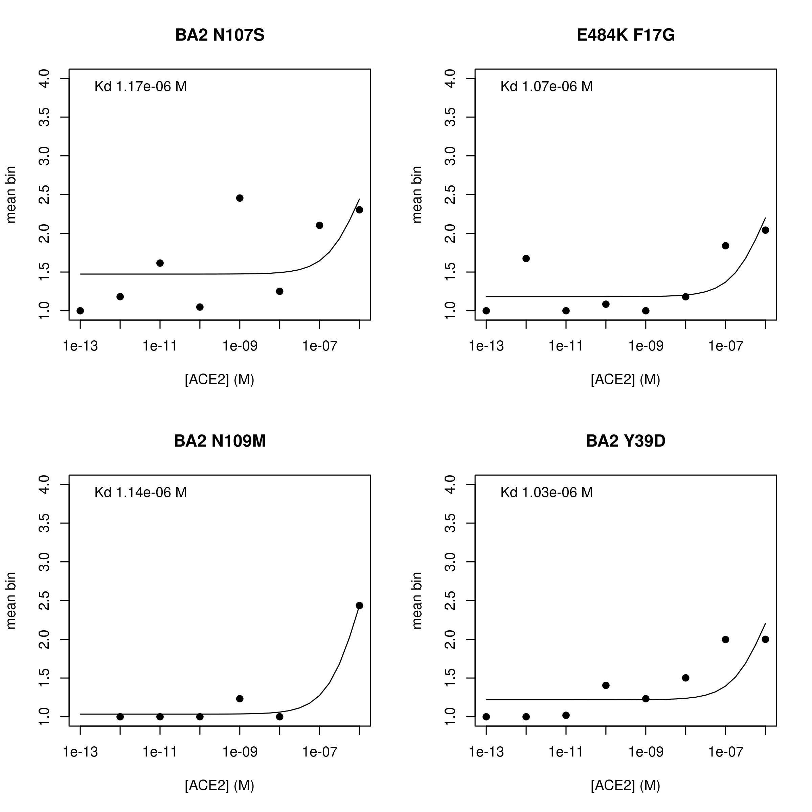

Compute per-barcode bat ACE2 binding affinity
================
Tyler Starr
05/12/2023

This notebook reads in per-barcode counts from `count_variants.ipynb`
for ACE2-binding Tite-seq experiments, computes functional scores for
RBD ACE2-binding affiniity, and does some basic QC on variant binding
functional scores.

``` r
#list of packages to install/load
packages = c("yaml","data.table","tidyverse","gridExtra")
#install any packages not already installed
installed_packages <- packages %in% rownames(installed.packages())
if(any(installed_packages == F)){
  install.packages(packages[!installed_packages],
                   lib=c(paste("/uufs/chpc.utah.edu/common/home/",Sys.getenv("USER"),"/RLibs/",Sys.getenv("R_VERSION"),sep="")),
                   repos=c("http://cran.us.r-project.org"))
}
#load packages
invisible(lapply(packages, library, character.only=T))

knitr::opts_chunk$set(echo = T)
knitr::opts_chunk$set(dev.args = list(png = list(type = "cairo")))

#read in config file
config <- read_yaml("config.yaml")

#make output directory
if(!file.exists(config$binding_scores_dir)){
  dir.create(file.path(config$binding_scores_dir))
}
```

Session info for reproducing environment:

``` r
sessionInfo()
```

    ## R version 4.1.3 (2022-03-10)
    ## Platform: x86_64-pc-linux-gnu (64-bit)
    ## Running under: Rocky Linux 8.5 (Green Obsidian)
    ## 
    ## Matrix products: default
    ## BLAS/LAPACK: /uufs/chpc.utah.edu/sys/spack/linux-rocky8-nehalem/gcc-8.5.0/intel-oneapi-mkl-2021.4.0-h43nkmwzvaltaa6ii5l7n6e7ruvjbmnv/mkl/2021.4.0/lib/intel64/libmkl_rt.so.1
    ## 
    ## locale:
    ##  [1] LC_CTYPE=en_US.UTF-8       LC_NUMERIC=C              
    ##  [3] LC_TIME=en_US.UTF-8        LC_COLLATE=en_US.UTF-8    
    ##  [5] LC_MONETARY=en_US.UTF-8    LC_MESSAGES=en_US.UTF-8   
    ##  [7] LC_PAPER=en_US.UTF-8       LC_NAME=C                 
    ##  [9] LC_ADDRESS=C               LC_TELEPHONE=C            
    ## [11] LC_MEASUREMENT=en_US.UTF-8 LC_IDENTIFICATION=C       
    ## 
    ## attached base packages:
    ## [1] stats     graphics  grDevices utils     datasets  methods   base     
    ## 
    ## other attached packages:
    ##  [1] gridExtra_2.3     forcats_0.5.1     stringr_1.4.0     dplyr_1.0.8      
    ##  [5] purrr_0.3.4       readr_2.1.2       tidyr_1.2.0       tibble_3.1.6     
    ##  [9] ggplot2_3.4.1     tidyverse_1.3.1   data.table_1.14.2 yaml_2.3.5       
    ## 
    ## loaded via a namespace (and not attached):
    ##  [1] tidyselect_1.1.2 xfun_0.30        haven_2.4.3      colorspace_2.0-3
    ##  [5] vctrs_0.5.2      generics_0.1.2   htmltools_0.5.2  utf8_1.2.2      
    ##  [9] rlang_1.0.6      pillar_1.7.0     glue_1.6.2       withr_2.5.0     
    ## [13] DBI_1.1.2        dbplyr_2.1.1     modelr_0.1.8     readxl_1.3.1    
    ## [17] lifecycle_1.0.3  munsell_0.5.0    gtable_0.3.0     cellranger_1.1.0
    ## [21] rvest_1.0.2      evaluate_0.15    knitr_1.37       tzdb_0.2.0      
    ## [25] fastmap_1.1.0    fansi_1.0.2      broom_0.7.12     Rcpp_1.0.8      
    ## [29] backports_1.4.1  scales_1.2.1     jsonlite_1.8.0   fs_1.5.2        
    ## [33] hms_1.1.1        digest_0.6.29    stringi_1.7.6    grid_4.1.3      
    ## [37] cli_3.6.0        tools_4.1.3      magrittr_2.0.2   crayon_1.5.0    
    ## [41] pkgconfig_2.0.3  ellipsis_0.3.2   xml2_1.3.3       reprex_2.0.1    
    ## [45] lubridate_1.8.0  rstudioapi_0.13  assertthat_0.2.1 rmarkdown_2.13  
    ## [49] httr_1.4.2       R6_2.5.1         compiler_4.1.3

## Setup

First, we will read in metadata on our sort samples, the table giving
number of reads of each barcode in each of the sort bins, and the
barcode-variant lookup tables, and merge these tables together.

``` r
#read dataframe with list of barcode runs
barcode_runs <- read.csv(file=config$barcode_runs,stringsAsFactors=F); barcode_runs <- subset(barcode_runs, select=-c(R1))

#eliminate rows from barcode_runs that are not from an tite-seq bat experiment
barcode_runs <- barcode_runs[barcode_runs$sample_type == "TiteSeq_bat",]

#read file giving count of each barcode in each sort partition
counts <- data.table(read.csv(file=config$variant_counts_file,stringsAsFactors=F))

#eliminate rows from counts that are not part of an titration bin sample
counts <- subset(counts, sample %in% barcode_runs[barcode_runs$sample_type=="TiteSeq_bat","sample"])

#read in barcode-variant lookup tables
dt <- data.table(read.csv(file=config$codon_variant_table,stringsAsFactors=F))


#make sure there's no duplicated barcodes within a library
duplicates <- dt[duplicated(dt,by=c("barcode","library")),.(library,barcode)] #the data.table duplciates function annoyingly only flags the first of each duplicate so doesn't intrinsically allow removal of both of the entries of the duplicate. So, flat what are duplciates, and then remove
dt[,duplicate:=FALSE]
for(i in 1:nrow(duplicates)){
  dt[library==duplicates[i,library] & barcode==duplicates[i,barcode],duplicate:=TRUE]
}
dt <- dt[duplicate==FALSE,]; dt[,duplicate:=NULL]

#merge counts and bc variant table
dt <- merge(counts, dt, by=c("library","barcode"));rm(counts); rm(duplicates)

#make tables giving names of Titeseq samples and the corresponding ACE2 incubation concentrations
samples_TiteSeq <- data.frame(sample=unique(paste(barcode_runs[barcode_runs$sample_type=="TiteSeq_bat","sample_type"],formatC(barcode_runs[barcode_runs$sample_type=="TiteSeq_bat","concentration"], width=2,flag="0"),sep="_")),conc1=c(1.1*10^-6, 1.1*10^-7, 1.1*10^-8, 1.1*10^-9, 1.1*10^-10, 1.1*10^-11, 1.1*10^-12, 1.1*10^-13,0),conc2=c(10^-6, 10^-7, 10^-8, 10^-9, 10^-10, 10^-11, 10^-12, 10^-13,0))
```

Convert from Illumina read counts to estimates of the number of cells
that were sorted into a bin, and add some other useful information to
our data frame.

``` r
#for each bin, normalize the read counts to the observed ratio of cell recovery among bins
for(i in 1:nrow(barcode_runs)){
  lib <- paste(as.character(barcode_runs$library[i]), as.character(barcode_runs$replicate[i]), sep="")
  bin <- as.character(barcode_runs$sample[i])
  ratio <- sum(dt[library==lib & sample==bin,"count"])/barcode_runs$number_cells[i]
  if(ratio<1){ #if there are fewer reads from a FACS bin than cells sorted
    dt[library==lib & sample==bin, count.norm := as.numeric(count)] #don't normalize cell counts, make count.norm the same as count
    print(paste("reads < cells for",lib,bin,", un-normalized (ratio",ratio,")")) #print to console to inform of undersampled bins
  }else{
    dt[library==lib & sample==bin, count.norm := as.numeric(count/ratio)] #normalize read counts by the average read:cell ratio, report in new "count.norm" column
    print(paste("read:cell ratio for",lib,bin,"is",ratio))
  }
}
```

    ## [1] "reads < cells for pool1 TiteSeq_bat_01_bin1 , un-normalized (ratio 0.861823675679078 )"
    ## [1] "read:cell ratio for pool1 TiteSeq_bat_01_bin2 is 2.07860774163743"
    ## [1] "read:cell ratio for pool1 TiteSeq_bat_01_bin3 is 2.68128128923989"
    ## [1] "read:cell ratio for pool1 TiteSeq_bat_01_bin4 is 2.70009851156476"
    ## [1] "read:cell ratio for pool1 TiteSeq_bat_02_bin1 is 2.32687402890563"
    ## [1] "read:cell ratio for pool1 TiteSeq_bat_02_bin2 is 2.80585619236297"
    ## [1] "read:cell ratio for pool1 TiteSeq_bat_02_bin3 is 2.80665489494732"
    ## [1] "read:cell ratio for pool1 TiteSeq_bat_02_bin4 is 2.63297368457713"
    ## [1] "read:cell ratio for pool1 TiteSeq_bat_03_bin1 is 2.76684349459237"
    ## [1] "read:cell ratio for pool1 TiteSeq_bat_03_bin2 is 3.04316553692144"
    ## [1] "read:cell ratio for pool1 TiteSeq_bat_03_bin3 is 2.53798328745729"
    ## [1] "read:cell ratio for pool1 TiteSeq_bat_03_bin4 is 2.97069400701378"
    ## [1] "read:cell ratio for pool1 TiteSeq_bat_04_bin1 is 2.54057029259104"
    ## [1] "read:cell ratio for pool1 TiteSeq_bat_04_bin2 is 2.89757038566077"
    ## [1] "read:cell ratio for pool1 TiteSeq_bat_04_bin3 is 2.2378748164587"
    ## [1] "read:cell ratio for pool1 TiteSeq_bat_04_bin4 is 2.99779594085775"
    ## [1] "read:cell ratio for pool1 TiteSeq_bat_05_bin1 is 2.63965301304953"
    ## [1] "read:cell ratio for pool1 TiteSeq_bat_05_bin2 is 2.66265105451873"
    ## [1] "reads < cells for pool1 TiteSeq_bat_05_bin3 , un-normalized (ratio 0.605395790097836 )"
    ## [1] "reads < cells for pool1 TiteSeq_bat_05_bin4 , un-normalized (ratio 0.401428571428571 )"
    ## [1] "read:cell ratio for pool1 TiteSeq_bat_06_bin1 is 2.69538664106641"
    ## [1] "read:cell ratio for pool1 TiteSeq_bat_06_bin2 is 2.66447623226687"
    ## [1] "reads < cells for pool1 TiteSeq_bat_06_bin3 , un-normalized (ratio 0.621121840969797 )"
    ## [1] "read:cell ratio for pool1 TiteSeq_bat_06_bin4 is 2.06020066889632"
    ## [1] "read:cell ratio for pool1 TiteSeq_bat_07_bin1 is 2.56036006984317"
    ## [1] "read:cell ratio for pool1 TiteSeq_bat_07_bin2 is 2.88268841156001"
    ## [1] "reads < cells for pool1 TiteSeq_bat_07_bin3 , un-normalized (ratio 0.519027822193796 )"
    ## [1] "read:cell ratio for pool1 TiteSeq_bat_07_bin4 is 12.7595307917889"
    ## [1] "read:cell ratio for pool1 TiteSeq_bat_08_bin1 is 2.64107231831693"
    ## [1] "read:cell ratio for pool1 TiteSeq_bat_08_bin2 is 3.42087324891716"
    ## [1] "reads < cells for pool1 TiteSeq_bat_08_bin3 , un-normalized (ratio 0.72234156820623 )"
    ## [1] "reads < cells for pool1 TiteSeq_bat_08_bin4 , un-normalized (ratio 0.484184914841849 )"
    ## [1] "read:cell ratio for pool1 TiteSeq_bat_09_bin1 is 2.86237499484497"
    ## [1] "read:cell ratio for pool1 TiteSeq_bat_09_bin2 is 2.80445244381678"
    ## [1] "read:cell ratio for pool1 TiteSeq_bat_09_bin3 is 1.097"
    ## [1] "read:cell ratio for pool1 TiteSeq_bat_09_bin4 is 1.76056338028169"
    ## [1] "read:cell ratio for pool2 TiteSeq_bat_01_bin1 is 1.69648893750662"
    ## [1] "read:cell ratio for pool2 TiteSeq_bat_01_bin2 is 2.85364061001288"
    ## [1] "read:cell ratio for pool2 TiteSeq_bat_01_bin3 is 2.55887691115716"
    ## [1] "read:cell ratio for pool2 TiteSeq_bat_01_bin4 is 2.2983691535909"
    ## [1] "read:cell ratio for pool2 TiteSeq_bat_02_bin1 is 2.43509515324138"
    ## [1] "read:cell ratio for pool2 TiteSeq_bat_02_bin2 is 2.33249648635036"
    ## [1] "read:cell ratio for pool2 TiteSeq_bat_02_bin3 is 2.70666454683665"
    ## [1] "read:cell ratio for pool2 TiteSeq_bat_02_bin4 is 2.60966195959466"
    ## [1] "read:cell ratio for pool2 TiteSeq_bat_03_bin1 is 2.71116437640032"
    ## [1] "read:cell ratio for pool2 TiteSeq_bat_03_bin2 is 2.61583808637983"
    ## [1] "read:cell ratio for pool2 TiteSeq_bat_03_bin3 is 2.47566214592002"
    ## [1] "read:cell ratio for pool2 TiteSeq_bat_03_bin4 is 1.87970656070248"
    ## [1] "read:cell ratio for pool2 TiteSeq_bat_04_bin1 is 2.48201541575325"
    ## [1] "read:cell ratio for pool2 TiteSeq_bat_04_bin2 is 2.33925653503031"
    ## [1] "read:cell ratio for pool2 TiteSeq_bat_04_bin3 is 2.55373913600791"
    ## [1] "read:cell ratio for pool2 TiteSeq_bat_04_bin4 is 1.32992"
    ## [1] "read:cell ratio for pool2 TiteSeq_bat_05_bin1 is 2.74085991016264"
    ## [1] "read:cell ratio for pool2 TiteSeq_bat_05_bin2 is 2.68039770577642"
    ## [1] "reads < cells for pool2 TiteSeq_bat_05_bin3 , un-normalized (ratio 0.959925093632959 )"
    ## [1] "read:cell ratio for pool2 TiteSeq_bat_05_bin4 is 3.89988751406074"
    ## [1] "read:cell ratio for pool2 TiteSeq_bat_06_bin1 is 2.44554190176468"
    ## [1] "read:cell ratio for pool2 TiteSeq_bat_06_bin2 is 2.07804339663431"
    ## [1] "reads < cells for pool2 TiteSeq_bat_06_bin3 , un-normalized (ratio 0.981507823613087 )"
    ## [1] "read:cell ratio for pool2 TiteSeq_bat_06_bin4 is 29.5192307692308"
    ## [1] "read:cell ratio for pool2 TiteSeq_bat_07_bin1 is 2.63205912866804"
    ## [1] "read:cell ratio for pool2 TiteSeq_bat_07_bin2 is 1.92293802496026"
    ## [1] "read:cell ratio for pool2 TiteSeq_bat_07_bin3 is 1.31803797468354"
    ## [1] "read:cell ratio for pool2 TiteSeq_bat_07_bin4 is 37.0434782608696"
    ## [1] "read:cell ratio for pool2 TiteSeq_bat_08_bin1 is 2.41668928633092"
    ## [1] "read:cell ratio for pool2 TiteSeq_bat_08_bin2 is 2.60634394687069"
    ## [1] "read:cell ratio for pool2 TiteSeq_bat_08_bin3 is 1.66666666666667"
    ## [1] "read:cell ratio for pool2 TiteSeq_bat_08_bin4 is 261.7"
    ## [1] "read:cell ratio for pool2 TiteSeq_bat_09_bin1 is 2.35676409983822"
    ## [1] "read:cell ratio for pool2 TiteSeq_bat_09_bin2 is 2.76666787876584"
    ## [1] "read:cell ratio for pool2 TiteSeq_bat_09_bin3 is 7.9182156133829"
    ## [1] "read:cell ratio for pool2 TiteSeq_bat_09_bin4 is 5.7"

``` r
#annotate each barcode as to whether it's a homolog variant, pD-CoV wildtype, synonymous muts only, stop, nonsynonymous, >1 nonsynonymous mutations
dt[,variant_class:=as.character(NA)]
dt[n_codon_substitutions==0, variant_class := "wildtype"]
dt[n_codon_substitutions > 0 & n_aa_substitutions==0, variant_class := "synonymous"]
dt[n_aa_substitutions>0 & grepl("*",aa_substitutions,fixed=T), variant_class := "stop"]
dt[n_aa_substitutions == 1 & !grepl("*",aa_substitutions,fixed=T), variant_class := "1 nonsynonymous"]
dt[n_aa_substitutions > 1 & !grepl("*",aa_substitutions,fixed=T), variant_class := ">1 nonsynonymous"]

#cast the data frame into wide format
dt <- dcast(dt, library + barcode + target + variant_class + aa_substitutions + n_aa_substitutions ~ sample, value.var="count.norm")
```

## Calculating mean bin for each barcode at each sample concentration

Next, for each barcode at each of the ACE2 concentrations, calculate the
“mean bin” response variable. This is calculated as a simple mean, where
the value of each bin is the integer value of the bin (bin1=unbound,
bin4=highly bound) – because of how bins are defined, the mean
fluorescence of cells in each bin are equally spaced on a log-normal
scale, so mean bin correlates with simple mean fluorescence.

We do not use the fluorescence boundaries of the FACS bins in our
calculations here, but we provide them for posterity’s sake below. For
the library titration sorts, the fluorescence boundaries for bins 1-4
are as follows:

``` r
#function that returns mean bin and sum of counts for four bins cell counts. Includes cutoffs for bimodal sample splits to filter out.
calc.meanbin <- function(vec, split13filter=0.4, split24filter=0.4, split14filter=0.4){
  total <- sum(vec)
  if(is.na(total) | (vec[1] > split13filter*total & vec[3] > split13filter*total) | (vec[2] > split24filter*total & vec[4] > split24filter*total) | (vec[1] > split14filter*total & vec[4] > split14filter*total)){
    return(list(NA,NA))
  }else{
    return( list((vec[1]*1+vec[2]*2+vec[3]*3+vec[4]*4)/(vec[1]+vec[2]+vec[3]+vec[4]), total) )
  }
}
  

#iterate through Titeseq samples, compute mean_bin and total_count for each barcode variant
for(i in 1:nrow(samples_TiteSeq)){ #iterate through titeseq sample (concentration)
  meanbin_out <- paste(samples_TiteSeq[i,"sample"],"_meanbin",sep="") #define the header name for the meanbin output for the given concentration sample
  totalcount_out <- paste(samples_TiteSeq[i,"sample"],"_totalcount",sep="") #define the header name for the total cell count output for the given concentration sample
  bin1_in <- paste(samples_TiteSeq[i,"sample"],"_bin1",sep="") #define the header names for the input cell counts for bins1-4 of the given concnetration sample
  bin2_in <- paste(samples_TiteSeq[i,"sample"],"_bin2",sep="")
  bin3_in <- paste(samples_TiteSeq[i,"sample"],"_bin3",sep="")
  bin4_in <- paste(samples_TiteSeq[i,"sample"],"_bin4",sep="")
  dt[,c(meanbin_out,totalcount_out) := calc.meanbin(c(get(bin1_in),get(bin2_in),get(bin3_in),get(bin4_in))),by=c("barcode","library")]
}
```

## Fit titration curves

We will use nonlinear least squares regression to fit curves to each
barcode’s titration series, with filters for a minimum cell count that
is required for a meanbin estimate to be used in the titration fit, and
a minimum number of concentrations with determined meanbin that is
required for a titration to be reported.

``` r
#For QC and filtering, output columns giving the average number of cells that were sampled for a barcode across the 9 sample concentrations, and a value for the number of meanbin estimates that were removed for being below the # of cells cutoff
cutoff <- 1
dt[,TiteSeq_bat_avgcount := mean(c(TiteSeq_bat_01_totalcount,TiteSeq_bat_02_totalcount,TiteSeq_bat_03_totalcount,TiteSeq_bat_04_totalcount,
                                TiteSeq_bat_05_totalcount,TiteSeq_bat_06_totalcount,TiteSeq_bat_07_totalcount,TiteSeq_bat_08_totalcount,
                                TiteSeq_bat_09_totalcount),na.rm=T),by=c("library","barcode")]

#number of concentrations at which meanbin is calculated from < cutoff cells or is missing b/c filtered for bimodality
dt[,TiteSeq_bat_min_cell_filtered := sum(c(c(TiteSeq_bat_01_totalcount,TiteSeq_bat_02_totalcount,TiteSeq_bat_03_totalcount,TiteSeq_bat_04_totalcount,
                                        TiteSeq_bat_05_totalcount,TiteSeq_bat_06_totalcount,TiteSeq_bat_07_totalcount,TiteSeq_bat_08_totalcount,
                                        TiteSeq_bat_09_totalcount)<cutoff,is.na(c(TiteSeq_bat_01_totalcount,TiteSeq_bat_02_totalcount,TiteSeq_bat_03_totalcount,TiteSeq_bat_04_totalcount,
                                                                             TiteSeq_bat_05_totalcount,TiteSeq_bat_06_totalcount,TiteSeq_bat_07_totalcount,TiteSeq_bat_08_totalcount,
                                                                             TiteSeq_bat_09_totalcount))),na.rm=T),by=c("library","barcode")]

#remove N501Y data
dt <- dt[target != "N501Y",]


#function that fits a nls regression to the titration series, including an option to filter below certain thresholds for average cells across all samples, and number of samples below a cutoff of cells
fit.titration <- function(y.vals,x.vals,count.vals,min.cfu=cutoff,
                          min.means=0.75,min.average=2*cutoff,Kd.start=1e-11,
                          a.start=3,a.lower=2,a.upper=3,
                          b.start=1,b.lower=1,b.upper=1.5){
  indices <- count.vals>min.cfu & !is.na(y.vals)
  y <- y.vals[indices]
  x <- x.vals[indices]
  if((length(y) < min.means*length(y.vals)) | (mean(count.vals,na.rm=T) < min.average)){ #return NAs if < min.means fraction of concentrations have above min.cfu counts or if the average count across all concentrations is below min.average
    return(list(as.numeric(NA),as.numeric(NA),as.numeric(NA),as.numeric(NA),as.numeric(NA)))
  }else{
    fit <- nls(y ~ a*(x/(x+Kd))+b,
               start=list(a=a.start,b=b.start,Kd=Kd.start),
               lower=list(a=a.lower,b=b.lower,Kd=min(x.vals[x.vals>0])/100), #constrain Kd to be no lower than 1/100x the lowest concentration value
               upper=list(a=a.upper,b=b.upper,Kd=max(x.vals[x.vals>0])*10), #constrain Kd to be no higher than the 10x highest concentration value
               algorithm="port")
    y.pred <- predict(fit,newdata=list(x=x))
    resid <- y - y.pred
    resid.norm <- resid/as.numeric(summary(fit)$coefficients["a","Estimate"])
    nMSR <- mean((resid.norm)^2,na.rm=T)
    return(list(as.numeric(summary(fit)$coefficients["Kd","Estimate"]),
                as.numeric(summary(fit)$coefficients["Kd","Std. Error"]),
                as.numeric(summary(fit)$coefficients["a","Estimate"]),
                as.numeric(summary(fit)$coefficients["b","Estimate"]),
                as.numeric(nMSR)))
  }
}

#fit titration to bat ACE2 Titeseq data for each barcode -- do separate pool1/2 because difference concentrations used
dt[library=="pool1",c("Kd_bat","Kd_SE_bat","response_bat","baseline_bat","nMSR_bat") :=
     tryCatch(fit.titration(y.vals=c(TiteSeq_bat_01_meanbin,TiteSeq_bat_02_meanbin,TiteSeq_bat_03_meanbin,TiteSeq_bat_04_meanbin,
                                     TiteSeq_bat_05_meanbin,TiteSeq_bat_06_meanbin,TiteSeq_bat_07_meanbin,TiteSeq_bat_08_meanbin,
                                     TiteSeq_bat_09_meanbin),
                            x.vals=samples_TiteSeq$conc1,
                            count.vals=c(TiteSeq_bat_01_totalcount,TiteSeq_bat_02_totalcount,TiteSeq_bat_03_totalcount,TiteSeq_bat_04_totalcount,
                                         TiteSeq_bat_05_totalcount,TiteSeq_bat_06_totalcount,TiteSeq_bat_07_totalcount,TiteSeq_bat_08_totalcount,TiteSeq_bat_09_totalcount)),
              error=function(e){list(as.numeric(NA),as.numeric(NA),as.numeric(NA),as.numeric(NA),as.numeric(NA))}),by=c("library","barcode")]

dt[library=="pool2",c("Kd_bat","Kd_SE_bat","response_bat","baseline_bat","nMSR_bat") :=
     tryCatch(fit.titration(y.vals=c(TiteSeq_bat_01_meanbin,TiteSeq_bat_02_meanbin,TiteSeq_bat_03_meanbin,TiteSeq_bat_04_meanbin,
                                     TiteSeq_bat_05_meanbin,TiteSeq_bat_06_meanbin,TiteSeq_bat_07_meanbin,TiteSeq_bat_08_meanbin,
                                     TiteSeq_bat_09_meanbin),
                            x.vals=samples_TiteSeq$conc2,
                            count.vals=c(TiteSeq_bat_01_totalcount,TiteSeq_bat_02_totalcount,TiteSeq_bat_03_totalcount,TiteSeq_bat_04_totalcount,
                                         TiteSeq_bat_05_totalcount,TiteSeq_bat_06_totalcount,TiteSeq_bat_07_totalcount,TiteSeq_bat_08_totalcount,TiteSeq_bat_09_totalcount)),
              error=function(e){list(as.numeric(NA),as.numeric(NA),as.numeric(NA),as.numeric(NA),as.numeric(NA))}),by=c("library","barcode")]
```

## QC and sanity checks

We will do some QC to make sure we got good titration curves for most of
our library barcodes. We will also spot check titration curves from
across our measurement range, and spot check curves whose fit parameters
hit the different boundary conditions of the fit variables.

We successfully generated *K*<sub>D</sub> estimates for 144335 of our
pool1 barcodes (68.62%), and 135077 of our pool2 barcodes (73.89%).

Why were estimates not returned for some barcodes? The histograms below
show that many barcodes with unsuccessful titration fits have lower
average cell counts and more concentrations with fewer than the minimum
cutoff number of cells (cutoff=1) than those that were fit. Therefore,
we can see the the majority of unfit barcodes come from our minimum read
cutoffs, meaning there weren’t too many curves that failed to be fit for
issues such as nls convergence.

``` r
par(mfrow=c(2,2))
hist(log10(dt[library=="pool1" & target!="N501Y" & !is.na(Kd_bat),TiteSeq_bat_avgcount]+0.5),breaks=20,xlim=c(0,5),main="pool1",col="gray50",xlab="average cell count across concentration samples")
hist(log10(dt[library=="pool1" & target!="N501Y" & is.na(Kd_bat),TiteSeq_bat_avgcount]+0.5),breaks=20,add=T,col="red")

hist(log10(dt[library=="pool2" & target!="N501Y" & !is.na(Kd_bat),TiteSeq_bat_avgcount]+0.5),breaks=20,xlim=c(0,5),main="pool2",col="gray50",xlab="average cell count across concentration samples")
hist(log10(dt[library=="pool2" & target!="N501Y" & is.na(Kd_bat),TiteSeq_bat_avgcount]+0.5),breaks=20,add=T,col="red")

hist(dt[library=="pool1" & target!="N501Y" & !is.na(Kd_bat),TiteSeq_bat_min_cell_filtered],breaks=5,main="pool1",col="gray50",xlab="number of sample concentrations below cutoff cell number",xlim=c(0,10))
hist(dt[library=="pool1" & target!="N501Y" & is.na(Kd_bat),TiteSeq_bat_min_cell_filtered],breaks=16,add=T,col="red")

hist(dt[library=="pool2" & target!="N501Y" & !is.na(Kd_bat),TiteSeq_bat_min_cell_filtered],breaks=5,main="pool2",col="gray50",xlab="number of sample concentrations below cutoff cell number",xlim=c(0,10))
hist(dt[library=="pool2" & target!="N501Y" & is.na(Kd_bat),TiteSeq_bat_min_cell_filtered],breaks=16,add=T,col="red")
```


Let’s checkout what the data looks like for some curves that didn’t
converge on a titration fit, different cutoffs, boudnary conditions,
etc. I define a function that take a row from the data table and plots
the meanbin estimates and the fit titration curve (if converged). This
allows for quick and easy troubleshooting and spot-checking of curves.

In the plots below for non-converging fits, we can see that the data
seem to have very low plateaus/signal over the concentration range and
perhaps some noise. I understand why they are difficult to fit, and I am
not worried by their exclusion, as I can’t by eye tell what their fit
should be hitting. My best guess is they would have a “response”
parameter lower than the minimum allowable, but that is also a hard Kd
then to estimate reliably so I’m ok not fitting these relatively small
number of curves.

To allow manual checks of what the data looks like for different curve
fits, I define functions that take a row from the dt table and the
corresponding table of fits, and plots the meanbin estimates and the fit
titration curve (if converged). This allows for quick and easy
troubleshooting and spot-checking of curves.

``` r
#make functions that allow me to plot a titration for any given row from the counts data frames, for spot checking curves
plot.titration <- function(row,output.text=F){
  y.vals <- c();for(sample in samples_TiteSeq$sample){y.vals <- c(y.vals,paste(sample,"_meanbin",sep=""))};y.vals <- unlist(dt[row,y.vals,with=F])
  x.vals <- samples_TiteSeq$conc2
  count.vals <- c();for(sample in samples_TiteSeq$sample){count.vals <- c(count.vals,paste(sample,"_totalcount",sep=""))};count.vals <- unlist(dt[row,count.vals,with=F])
  if(dt[row,variant_class] %in% c("wildtype","synonymous")){
    title <- dt[row,target]
  }else{
    title <- paste(dt[row,target],dt[row,aa_substitutions])
  }
  indices <- count.vals>cutoff & !is.na(count.vals)
  y.vals <- y.vals[indices]
  x.vals <- x.vals[indices]
  plot(x.vals,y.vals,xlab="[ACE2] (M)",
       ylab="mean bin",log="x",ylim=c(1,4),xlim=c(1e-13,1e-6),pch=19,main=title)
  Kd_var <- "Kd_bat"
  fit <- nls(y.vals ~ a*(x.vals/(x.vals+Kd))+b,
             start=list(a=3,b=1,Kd=10^-11),
             lower=list(a=2,b=1,Kd=1e-15),
             upper=list(a=3,b=1.5,Kd=1e-5), #constrain Kd to be no higher than the 10x highest concentration value
             algorithm="port") 
  if(!is.na(dt[row,get(Kd_var)])){
    lines(10^c(seq(-13,-6,0.25)),predict(fit,newdata=list(x.vals=10^c(seq(-13,-6,0.25)))))
    legend("topleft",bty="n",cex=1,legend=paste("Kd",format(dt[row,get(Kd_var)],digits=3),"M"))
  }
  if(output.text==T){ #for troubleshooting and interactive work, output some info from the counts table for the given row
    vars <- c("library","barcode","target","variant_class","aa_substitutions","TiteSeq_bat_avgcount","TiteSeq_bat_min_cell_filtered","Kd_bat","Kd_SE_bat","baseline_bat","response_bat","nMSR_bat")
    return(dt[row,..vars])
  }
}
```

Distribution of Kd estimates, with wt/syn barcodes in purple:

``` r
par(mfrow=c(3,1))
hist(log10(dt[target=="Wuhan_Hu_1",Kd_bat]),col="gray40",breaks=60,xlab="log10(KD), ACE2 (M)",main="Wuhan_Hu_1",xlim=c(-13,-5))
hist(log10(dt[target=="Wuhan_Hu_1" & variant_class %in% (c("synonymous","wildtype")),Kd_bat]),col="#92278F",add=T,breaks=60)
hist(log10(dt[target=="E484K",Kd_bat]),col="gray40",breaks=60,xlab="log10(KD), ACE2 (M)",main="E484K",xlim=c(-13,-5))
hist(log10(dt[target=="E484K" & variant_class %in% (c("synonymous","wildtype")),Kd_bat]),col="#92278F",add=T,breaks=60)
hist(log10(dt[target=="BA2",Kd_bat]),col="gray40",breaks=60,xlab="log10(KD), ACE2 (M)",main="BA2",xlim=c(-13,-5))
hist(log10(dt[target=="BA2" & variant_class %in% (c("synonymous","wildtype")),Kd_bat]),col="#92278F",add=T,breaks=60)
```


``` r
#save pdf
invisible(dev.print(pdf, paste(config$binding_scores_dir,"/hist_Kd_bat-per-barcode.pdf",sep="")))
```

Some stop variants eked through our RBD+ selection, either perhaps
because of stop codon readthrough, improper PacBio sequence annotation,
or other weirdness. Either way, the vast majority of nonsense mutants
were purged before this step, and the remaining ones are biased toward
unreliable and so we remove them.

``` r
#remove stop variants
dt[variant_class == "stop",c("Kd_bat","Kd_SE_bat","response_bat","baseline_bat","nMSR_bat") := list(as.numeric(NA),as.numeric(NA),as.numeric(NA),as.numeric(NA),as.numeric(NA))]
```

Let’s take a look at some of the curves with *K*<sub>D,app</sub> values
across this distribution to get a broad sense of how things look.

First, curves with *K*<sub>D,app</sub> fixed at the 10<sup>-5</sup>
maximum. We can see these are all flat-lined curves with no response.

``` r
par(mfrow=c(2,2))
plot.titration(which(dt$library=="pool1" & dt$Kd_bat > 9e-6)[1])
plot.titration(which(dt$library=="pool1" & dt$Kd_bat > 9e-6)[2])
plot.titration(which(dt$library=="pool2" & dt$Kd_bat > 9e-6)[1])
plot.titration(which(dt$library=="pool2" & dt$Kd_bat > 9e-6)[2])
```


Next, with *K*<sub>D,app</sub> around 10<sup>-6</sup>

``` r
par(mfrow=c(2,2))
plot.titration(which(dt$library=="pool1" & dt$Kd_bat > 1e-6 & dt$Kd_bat < 1.2e-6)[1])
plot.titration(which(dt$library=="pool1" & dt$Kd_bat > 1e-6 & dt$Kd_bat < 1.2e-6)[2])
plot.titration(which(dt$library=="pool2" & dt$Kd_bat > 1e-6 & dt$Kd_bat < 1.2e-6)[1])
plot.titration(which(dt$library=="pool2" & dt$Kd_bat > 1e-6 & dt$Kd_bat < 1.2e-6)[2])
```



With *K*<sub>D,app</sub> around 10<sup>-7</sup>, we seem to be picking
up more consistent binding signals, though there are some noisy curves.

``` r
par(mfrow=c(2,2))
plot.titration(which(dt$library=="pool1" & dt$Kd_bat > 1e-7 & dt$Kd_bat < 1.2e-7)[1])
plot.titration(which(dt$library=="pool1" & dt$Kd_bat > 1e-7 & dt$Kd_bat < 1.2e-7)[2])
plot.titration(which(dt$library=="pool2" & dt$Kd_bat > 1e-7 & dt$Kd_bat < 1.2e-7)[1])
plot.titration(which(dt$library=="pool2" & dt$Kd_bat > 1e-7 & dt$Kd_bat < 1.2e-7)[2])
```


*K*<sub>D,app</sub> of 10<sup>-8</sup>

``` r
par(mfrow=c(2,2))
plot.titration(which(dt$library=="pool1" & dt$Kd_bat > 1e-8 & dt$Kd_bat < 1.2e-8)[1])
plot.titration(which(dt$library=="pool1" & dt$Kd_bat > 1e-8 & dt$Kd_bat < 1.2e-8)[2])
plot.titration(which(dt$library=="pool2" & dt$Kd_bat > 1e-8 & dt$Kd_bat < 1.2e-8)[1])
plot.titration(which(dt$library=="pool2" & dt$Kd_bat > 1e-8 & dt$Kd_bat < 1.2e-8)[2])
```


*K*<sub>D,app</sub> of 10<sup>-9</sup>.

``` r
par(mfrow=c(2,2))
plot.titration(which(dt$library=="pool1" & dt$Kd_bat > 1e-9 & dt$Kd_bat < 1.2e-9)[1])
plot.titration(which(dt$library=="pool1" & dt$Kd_bat > 1e-9 & dt$Kd_bat < 1.2e-9)[2])
plot.titration(which(dt$library=="pool2" & dt$Kd_bat > 1e-9 & dt$Kd_bat < 1.2e-9)[1])
plot.titration(which(dt$library=="pool2" & dt$Kd_bat > 1e-9 & dt$Kd_bat < 1.2e-9)[2])
```


*K*<sub>D,app</sub> of 10<sup>-10</sup> curves looking more routinely
good

``` r
par(mfrow=c(2,2))
plot.titration(which(dt$library=="pool1" & dt$Kd_bat > 1e-10 & dt$Kd_bat < 1.2e-10)[1])
plot.titration(which(dt$library=="pool1" & dt$Kd_bat > 1e-10 & dt$Kd_bat < 1.2e-10)[2])
plot.titration(which(dt$library=="pool2" & dt$Kd_bat > 1e-10 & dt$Kd_bat < 1.2e-10)[1])
plot.titration(which(dt$library=="pool2" & dt$Kd_bat > 1e-10 & dt$Kd_bat < 1.2e-10)[2])
```


*K*<sub>D,app</sub> of 10<sup>-11</sup>

``` r
par(mfrow=c(2,2))
plot.titration(which(dt$library=="pool1" & dt$Kd_bat > 1e-11 & dt$Kd_bat < 1.2e-11)[1])
plot.titration(which(dt$library=="pool1" & dt$Kd_bat > 1e-11 & dt$Kd_bat < 1.2e-11)[2])
plot.titration(which(dt$library=="pool2" & dt$Kd_bat > 1e-11 & dt$Kd_bat < 1.2e-11)[1])
plot.titration(which(dt$library=="pool2" & dt$Kd_bat > 1e-11 & dt$Kd_bat < 1.2e-11)[2])
```


*K*<sub>D,app</sub> of 10<sup>-12</sup>

``` r
par(mfrow=c(2,2))
plot.titration(which(dt$library=="pool1" & dt$Kd_bat > 1e-12 & dt$Kd_bat < 1.2e-12)[1])
plot.titration(which(dt$library=="pool1" & dt$Kd_bat > 1e-12 & dt$Kd_bat < 1.2e-12)[2])
plot.titration(which(dt$library=="pool2" & dt$Kd_bat > 1e-12 & dt$Kd_bat < 1.2e-12)[1])
plot.titration(which(dt$library=="pool2" & dt$Kd_bat > 1e-12 & dt$Kd_bat < 1.2e-12)[2])
```


\## Data filtering by fit quality

Next, let’s filter out poor fits using the value we previously computed,
the *normalized* mean square residual (nMSR). This metric computes the
residual between the observed response variable and that predicted from
the titration fit, normalizes this residual by the response range of the
titration fit (which is allowed to vary between 1.5 and 3 per the
titration fits above), and computes the mean-square of these normalized
residuals.

Look at nMSR metric versus avgcoutn value, and layer on value of nMSR
filtering based on 20x the global median (and percentage filtered from
each background). Filter to NA fits with nMSR above this cutoff

``` r
median.nMSR <- median(dt$nMSR_bat,na.rm=T)
threshold <- 20
for(bg in c("Wuhan_Hu_1","BA2","E484K")){
  plot(log10(dt[target==bg,TiteSeq_bat_avgcount]),dt[target==bg,nMSR_bat],main=bg,pch=19,col="#00000010",xlab="average cell count (log10)",ylab="nMSR",xlim=c(0,6),ylim=c(0,0.5))
  abline(h=threshold*median.nMSR,col="red",lty=2)
  legend("topleft",bty="n",cex=1,legend=paste(format(100*nrow(dt[target==bg & nMSR_bat > threshold*median.nMSR & !is.na(nMSR_bat),])/nrow(dt[target==bg & !is.na(nMSR_bat),]),digits=3),"%"))
}
```


``` r
dt[nMSR_bat > threshold*median.nMSR,c("Kd_bat","Kd_SE_bat","response_bat","baseline_bat") := list(as.numeric(NA),as.numeric(NA),as.numeric(NA),as.numeric(NA))]
```

Last, convert our *K*<sub>D,app</sub> to 1) a log<sub>10</sub>-scale,
and 2) *K*<sub>A,app</sub>, the inverse of *K*<sub>D,app</sub>, such
that higher values are associated with tighter binding, as is more
intuitive. (If we want to continue to discuss in terms of
*K*<sub>D,app</sub>, since people are often more familiar with
*K*<sub>D</sub>, we can refer to the
log<sub>10</sub>(*K*<sub>A,app</sub>) as
-log<sub>10</sub>(*K*<sub>D,app</sub>), which are identical.

``` r
dt[,log10Ka_bat := -log10(Kd_bat),by=c("barcode","library")]
```

Let’s visualize the final binding measurements as violin plots for the
different variant types. In next notebook, we’ll evaluate count depth
and possibly apply further filtering

``` r
p1 <- ggplot(dt[!is.na(log10Ka_bat),],aes(x=variant_class,y=log10Ka_bat))+
  geom_violin(scale="width")+stat_summary(fun=median,geom="point",size=1)+
  ggtitle("bat ACE2, log10(Ka)")+xlab("variant class")+theme(axis.text.x=element_text(angle=-90,hjust=0))+
  facet_wrap(~target,ncol=1)

grid.arrange(p1,ncol=1)
```


``` r
#save pdf
invisible(dev.print(pdf, paste(config$binding_scores_dir,"/violin-plot_log10Ka_bat-by-target.pdf",sep="")))
```

We have generated binding measurements for 70.73% of the barcodes in our
libraries.

## Data Output

Finally, let’s output our measurements for downstream analyses.

``` r
dt[,.(library,barcode,target,variant_class,aa_substitutions,n_aa_substitutions,
     TiteSeq_bat_avgcount,log10Ka_bat)] %>%
  mutate_if(is.numeric, round, digits=6) %>%
  write.csv(file=config$bat_Kds_file, row.names=F)
```
