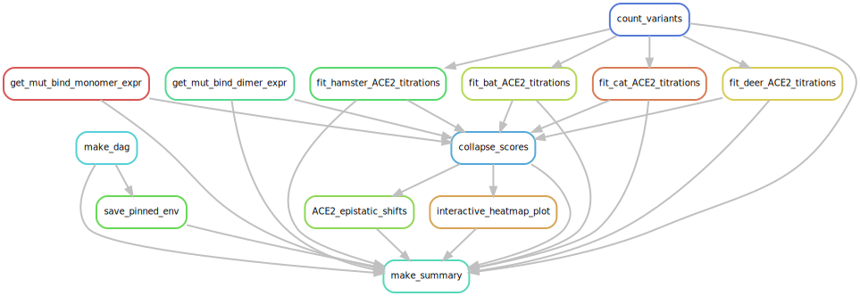

# Summary

Analysis run by [Snakefile](../../Snakefile)
using [this config file](../../config.yaml).
See the [README in the top directory](../../README.md)
for details.

Here is the DAG of the computational workflow:

Here is the Markdown output of each Jupyter notebook in the
workflow:

1. Download prior data for barcode-variant lookup tables and huACE2 binding from prior repositories [1](https://github.com/jbloomlab/SARS-CoV-2-RBD_DMS) and [2](https://github.com/jbloomlab/SARS-CoV-2-RBD_DMS_Omicron).

2. [Count variants by barcode](count_variants.md).
   Creates a [variant counts file](../counts/variant_counts.csv.gz)
   giving counts of each barcoded variant in each condition.

3. [Fit deer ACE2 titration curves](compute_deer-ACE2_Kd.md) to calculate per-barcode KD,app, recorded in [this file](../binding_scores/deer-ACE2_bc_binding.csv).

4. [Fit hamster ACE2 titration curves](compute_hamster-ACE2_Kd.md) to calculate per-barcode KD,app, recorded in [this file](../binding_scores/hamster-ACE2_bc_binding.csv).

5. [Fit bat ACE2 titration curves](compute_bat-ACE2_Kd.md) to calculate per-barcode KD,app, recorded in [this file](../binding_scores/bat-ACE2_bc_binding.csv).

6. [Fit cat ACE2 titration curves](compute_cat-ACE2_Kd.md) to calculate per-barcode KD,app, recorded in [this file](../binding_scores/cat-ACE2_bc_binding.csv).

7. [Derive final genotype-level phenotypes from replicate barcoded sequences](collapse_scores.md).
   Generates final phenotypes, recorded in [this file](../final_variant_scores/final_variant_scores.csv).

8. Make interactive data visualizations, available [here](https://tstarrlab.github.io/SARS-CoV-2-RBD_DMS_animal-ACE2/)